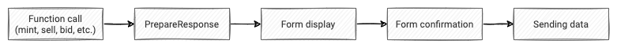

# SDK Overview

Rarible Protocol Software Development Kit enables applications to interact with Rarible protocol easily: query, issue, trade NFTs on any blockchain supported.

Currently, these blockchains are supported:

- Ethereum (rinkeby, mainnet)
- Flow (currently on devnet only)
- Tezos (on granada testnet)

Protocol SDK is available on GitHub: [https://github.com/rarible/sdk](https://github.com/rarible/sdk)

## Installation

```
npm install -D @rarible/sdk
```

or

```
yarn add @rarible/sdk
```

## Usage

SDK is written in typescript. You can use typings to explore SDK possibilities.

To use SDK, first you have to create a Wallet - abstraction to communicate with real blockchain wallets:

```typescript
// Initialize ethereum wallet
import { EthereumWallet } from "@rarible/sdk-wallet"

const ethereum = new Web3Ethereum({ web3, from })
const ethereumWallet = new EthereumWallet(ethereum, from) 
```

```typescript
// WIP: how to initialize Tezos and Flow wallets
```

```typescript
// Initialize SDK

import { createRaribleSdk } from "@rarible/sdk"

// Wallet - created before
// Second parameter - is environment: "prod" | "staging" | "e2e" | "dev"
const sdk = createRaribleSdk(wallet, "prod")
```

### Basic scenario

There are several main functions in Rarible protocol.

- [Mint](mint.md)
- [Transfer](transfer.md)
- [Sell](sell.md)
- Bid
- Burn
- Fill

The order is the same for all functions:

1. Call the function (mint, sell, bid, etc.).
2. The result of the `PrepareResponse` is returned. It has everything you need to display the form. For example, for Sell, there will be a description of which currencies can be used for sale.
3. Form display. For example, for Sell, you need to fill in the fields: how much you want to sell, price.
4. Form confirmation.
5. Sending data using `submit` from `PrepareResponse`.



### Querying

Here are some basic examples of how to use APIs to query data. You can find much more methods in the doc: http://api-dev.rarible.org/v0.1/doc or right in the typescript typings.

```typescript

// Fetch items by creator
sdk.apis.item.getItemsByCreator({ creator: someAddress })

// Fetch activity (events) by the Item
sdk.apis.activity.getActivitiesByItem({ type: ["TRANSFER"], contract, tokenId })

//etc... pls explore SDK apis and openapi docs
```
