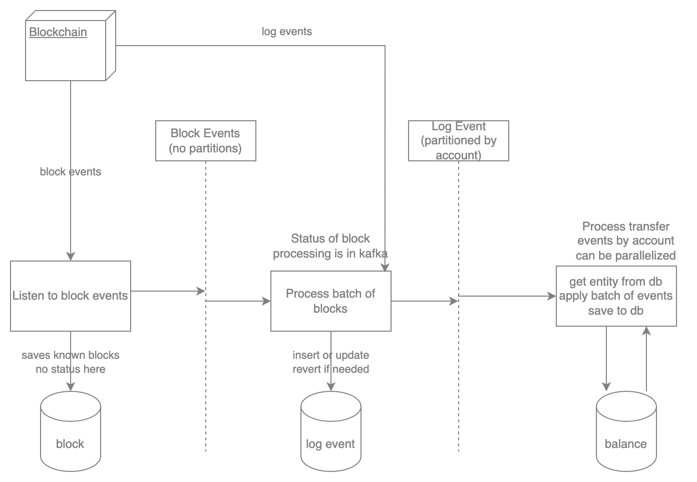

# API and Indexer Overview

The main functions of the API and indexer are:

- Follow the blockchain
- Handle read requests
- Process creation requests

## Architecture

The Rarible Protocol Ethereum indexer consists of the following parts:

- [NFT indexer](https://github.com/rarible/ethereum-indexer/blob/master/nft) — aggregates NFTs data
- [ERC-20 indexer](https://github.com/rarible/ethereum-indexer/blob/master/erc20) — aggregates data about ERC-20 tokens and balances
- [Order indexer](https://github.com/rarible/ethereum-indexer/blob/master/order) — aggregates Orders data from different platforms

Each indexer listens to a specific part of the Ethereum blockchain. The indexers can be used to request data about the state of the blockchain.

Indexers generate events when the state changes. They are developed with Spring Framework and use these external services:

- MongoDB — main data storage
- Apache Kafka — event handling

## Controllers

1. To create or modify NFTs and search information about them:
    * nft-transaction-controller
    * nft-lazy-mint-controller
    * nft-activity-controller
    * nft-ownership-controller
    * nft-item-controller
    * nft-collection-controller
2. To create or modify orders and search information about them:
    * order-signature-controller
    * order-encode-controller
    * order-controller
    * order-transaction-controller
    * order-activity-controller
    * order-aggregation-controller
    * nft-order-ownership-controller
    * nft-order-item-controller
    * nft-order-activity-controller
    * nft-order-collection-controller
3. Additional controllers:
    * gateway-controller
    * erc20-balance-controller
    * erc20-token-controller
    * lock-controller

## API usage Examples

* [Search Items](search-items.md)
* [Search Orders](search-orders.md)
* [Create Lazy Minting](create-lazy-minting.md)
* [Create Orders](create-orders.md)
