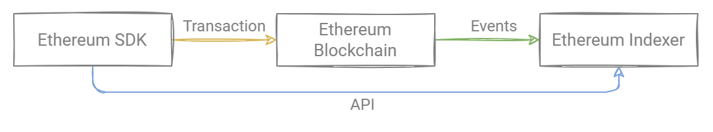

# Rarible Protocol Ethereum

## Overview

Rarible Protocol Ethereum is a set of tools to query, issue, and trade NFTs in the Ethereum blockchain network. It consists of Smart Contracts, Indexer, API, and SDK.

Main features:

- Decentralized Exchange
- Open Source Indexer
- Minting single (ERC-721) and multiple (ERC-1155) tokens, including lazy minting
- Ability to share Fees
- Royalties Support
- Public Order Book

## Smart Contracts

Rarible Smart Contracts for Ethereum are stored on the Ethereum blockchain. They will run when predetermined conditions are met.

See more about the consists of smart contracts on [Smart Contracts](smart-contracts/smart-contracts.md) page.

For more information on using Rarible Smart Contracts, see the page [Protocol Contracts](https://github.com/rarible/protocol-contracts) on GitHub.

## API Reference

Use these base URLs to access API on different Ethereum networks:

| Base URL | Network | Chain ID |
| :--- | :--- | :--- |
| [https://ethereum-api.rarible.org/v0.1/doc](https://ethereum-api.rarible.org/v0.1/doc) | Mainnet | 1 |
| [https://ethereum-api-staging.rarible.org/v0.1/doc](https://ethereum-api-staging.rarible.org/v0.1/doc) | Rinkeby | 4 |
| [https://ethereum-api-dev.rarible.org/v0.1/doc](https://ethereum-api-dev.rarible.org/v0.1/doc) | Ropsten | 3 |
| [https://ethereum-api-e2e.rarible.org/v0.1/doc](https://ethereum-api-e2e.rarible.org/v0.1/doc) | - | - |

For more information about working with the API and examples, see the page [API and Indexer](.../api/ethereum-api-indexer.md).

The Rarible Protocol Ethereum Indexer consists of the following parts:

- [NFT indexer](https://github.com/rarible/ethereum-indexer/blob/master/nft) — aggregates NFTs data
- [ERC-20 indexer](https://github.com/rarible/ethereum-indexer/blob/master/erc20) — aggregates data about ERC-20 tokens and balances
- [Order indexer](https://github.com/rarible/ethereum-indexer/blob/master/order) — aggregates Orders data from different platforms

Each Indexer listens to a specific part of the Ethereum blockchain. Users can use Indexers to request data about the state of the blockchain.

Indexers generate events when the state changes. They are developed with Spring Framework and use these external services:

- MongoDB — main data storage
- Apache Kafka — event handling

For more information about Indexer, see the page [Ethereum Indexer](https://github.com/rarible/ethereum-indexer) on GitHub.

## SDK

Rarible Protocol Ethereum SDK can help interact with your application and the Rarible protocol.

Main features:
- Create Mint and Lazy Minting ERC-721 and ERC-1155 tokens
- Create Sell Orders
- Create and accept Bid
- Buy tokens
- Transfer tokens
- Burn tokens

For more information on using the Rarible Protocol Ethereum SDK, see the page [Protocol Ethereum SDK](https://github.com/rarible/protocol-ethereum-sdk) on GitHub.
