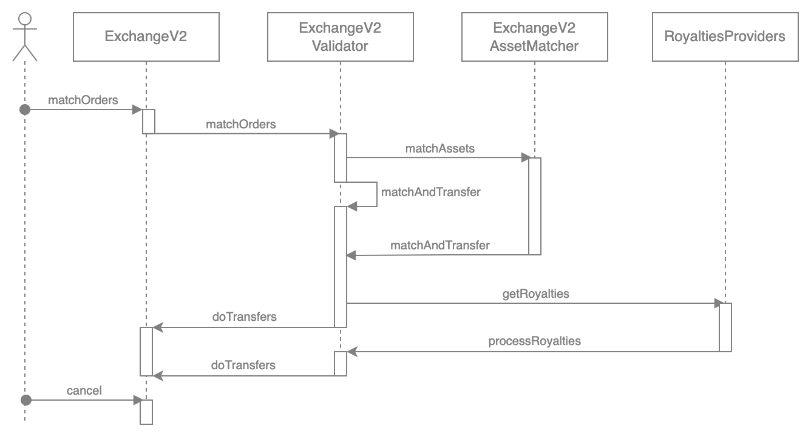

# ExchangeV2 Matching Orders

The main function of ExchangeV2 is matchOrders. This function takes two sides of order and attempts to match them.

The matching order process can be divided into stages:

1. **Order Validation** — checks if the order parameters are valid and the caller is authorized to execute the order.
2. **Asset Matching** — checks the assets from left & right order match and then extracts the matching assets.
3. **Calculating Fill** — checks and finds out what exact values should be filled. Orders can also be matched partly. This occurs if one of the sides doesn't want to fill other orders completely.
4. **Order Execution, Transfers** - execute the transfers of the assets, saving Order filling if necessary.

<figure markdown>
{ width="600" }
  <figcaption>Matching order</figcaption>
</figure>

## Order Validation

1. Check the start/end date of the order.
2. Check whether the receiver of this order is empty or the receiver is the same as order.taker.
3. Check whether the order is signed by its creator or the creator of the order performs a transaction.
4. If the creator of the order is a contract, then an ERC-1271 check is performed.

Currently, only orders outside the blockchain network are supported. This part of the smart contract can be easily updated to support Order Book on-chain.

## Asset Matching

The main goal is to check that **makeAsset** (left) matches **takeAsset** (right) and vice versa.

**makeAsset** is what you sell.

- The purchase order is what you pay for the seller's NFT. It can be ERC-20, ERC-721, ERC-1155, or any custom resource that uses the asset mapping interface.
- The sales order is the NFT that you are selling.

**takeAsset** is what you accept in return.

- The purchase order is the NFT that you are buying.
- The sales order is what you are willing to accept.

New asset types can be added without updating the smart contract. You can do it with a custom IAssetMatcher.

Possible improvements:

- Support for parametric assets. For example, a user can place an order to exchange 10 ETH for any NFT from a popular collection.
- Support for NFT packages.

## Calculating Fill and Order Execution

The order fill is stored inside the smart contract and refers to the taking part of the order. Fill is stored inside the mapping slot, the key to which is calculated using the fields:

- maker
- make asset type
- take asset type
- salt

Fill orders that differ only in the exchange rate are stored in one mapping slot.

In addition, full filled orders can be expanded: users can sign new orders using the same salt. For example, they can increase make.value and take.value.

**Priority of the order rate** — if the exchange rates differ, but orders can be filled (for example, the left order is 10X -> 100Y, and the right one is 100Y -> 5X), then the part on the left determines the exchange rate.

**Rounding errors** — mathematical operations calculate the filling volumes. When rounding is performed and the error exceeds 0.1%, a rounding error will be issued, and the order will not be executed.

## Transfer Execution

Transfers are made using RaribleTransferManager. It takes into account protocol commissions, royalties, etc.

It is planned to expand the RaribleTransferManager to support more royalty schemes and add new features. For example, user fees or multiple order recipients.

This part of the algorithm can be extended using ITransferExecutor. It will be added new executors to support new asset types. For example, an executor may be added to process packages.

Possible improvements:

- Package support.
- Support for random boxes.
