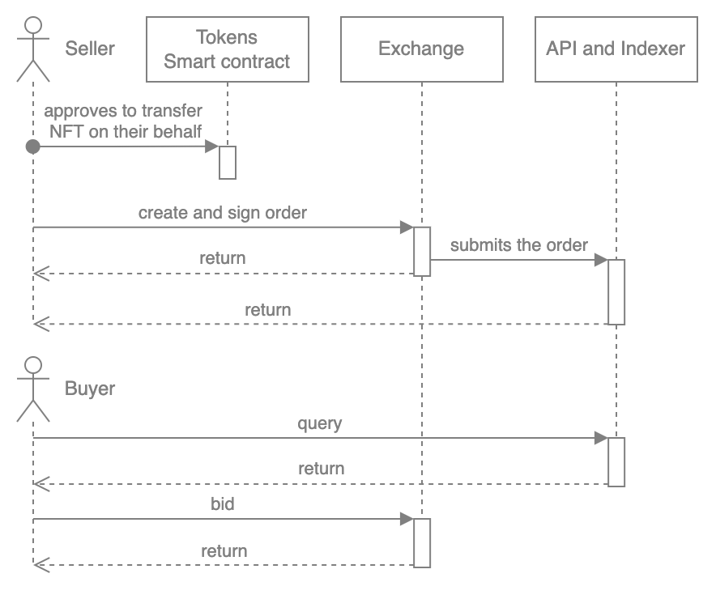

# ExchangeV2 Overview

ExchangeV2 is a smart contract for the decentralized exchange of any assets represented in the Ethereum blockchain (or compatible with EVM).

To make an exchange required two Orders:

1. Order for sale — created by the seller.
2. Purchase Order — Bid made by the buyer.

The exchange occurs if the Orders match.

The general process of creating and executing an Order is as follows:

1. The seller confirms that the Exchange contract can dispose of its assets, tokens.
2. The seller creates and signs an Order. Specifies the types and amounts of assets he wants to receive in return.
3. The seller sends the Order to the Indexer.
4. The buyer requests an Indexer to get an Order for a specific item or collection.
5. The buyer creates a Bid.
1. If the Order and Bid match, an exchange takes place.
2. If the Order and Bid do not match, then the seller can accept the Bid or not. If it accepts, then an exchange takes place.

The Order can be signed or not. The signature may be missing if the transaction is executed by the person who created this Order.

See more information about:

- [ExchangeV2 Matching Orders](exchangev2-matching-orders.md)
- [ExchangeV2 Sell and Bid](exchangev2-sell-bid.md)
- [ExchangeV2 Update and Cancel](exchangev2-update-cancel.md)
