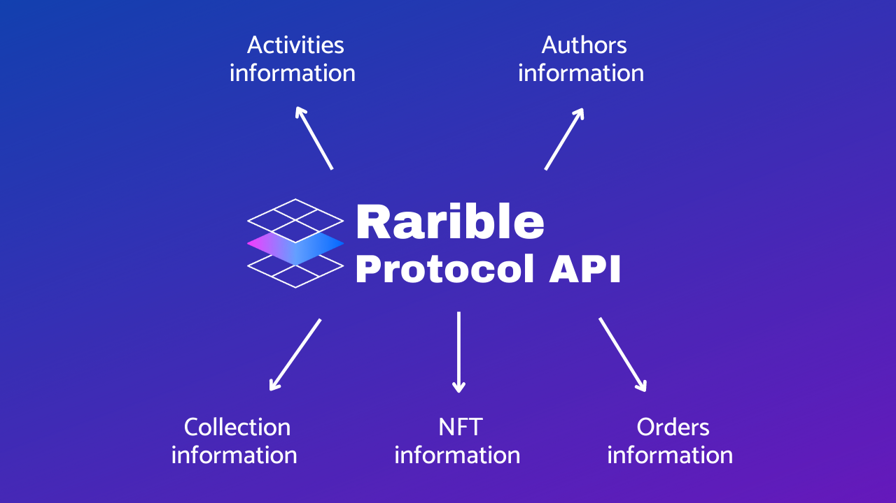
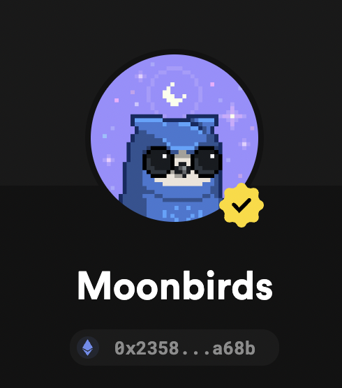

# How to fetch NFT data using Rarible Multichain API



[In the previous article](nft-101.md), we showed you how to find NFTs you’re interested in, by using different searching parameters (such as collection, address, or user name) on a marketplace’s website. In general, that’s a very simple process…unless you want to fetch details from many different NFTs.

In this article, we’ll learn how to get information on NFTs-related activities, straight from the source. In other words, we will cover how you can implement the same functionality you see on the [Rarible Marketplace](https://rarible.com/), using the Rarible Multichain Protocol.

The [Rarible Multichain Protocol](https://multichain-api.rarible.org/) is an API developed by the Rarible team that allows you to fetch activity information of different NFT projects — NFTs details, orders, owners, bids, etc. Since we will be using an API to get information, you’ll be able to fully automate the search process and do it in a structured and repetitive manner.

## API Overview

The [Rarible Multichain Protocol](https://multichain-api.rarible.org/) organizes search capabilities in a set of controllers. Each controller provides a fine-grained API to retrieve certain pieces of information about the NFT, or any of its attributes.

The API comprises the following controllers:

* [Signature Controller](https://multichain-api.rarible.org/v0.1#tag/signature-controller) — responsible for verifying signatures of messages
* [Currency Controller](https://multichain-api.rarible.org/v0.1#tag/currency-controller) — it allows us to get a USDC rate for a given token
* [Item Controller](https://multichain-api.rarible.org/v0.1#tag/item-controller) — it lets us check all sorts of item-related information, like item details, owner, collection, etc.
* [Ownership Controller](https://multichain-api.rarible.org/v0.1#tag/ownership-controller) — returns ownership details
* [Order Controller](https://multichain-api.rarible.org/v0.1#tag/order-controller) — responsible for fetching order information, like sell order, order by id, orders by the maker
* [Auction Controller](https://multichain-api.rarible.org/v0.1#tag/auction-controller) — auctions related information (auctions are not yet supported on the API)
* [Activity Controller](https://multichain-api.rarible.org/v0.1#tag/activity-controller) — activity information, such as token transfer, minting, burning, aggregated by users, items, collections
* [Collection Controller](https://multichain-api.rarible.org/v0.1#tag/collection-controller) — collections-related information

As you can see, there is a controller for every imaginable parameter, so getting the desired information won’t be a problem. The hard part is to easily navigate through the information we get from them, and make our logic as simple as possible.

## Search for a collection

Let’s recreate a simple scenario, just to put this into context.

Let’s say that the only information we have about a collection is its ID, aka collection address. It’s the [moonbird collection](https://rarible.com/collection/0x23581767a106ae21c074b2276d25e5c3e136a68b/items), and we want to know everything about it. We access the [Rarible Multichain API docs](https://multichain-api.rarible.org/v0.1#tag/collection-controller) and start building.

Since the only information we have is the collection address, the first endpoint we’ll use is `getCollectionById`. To be precise, it’s this one.

<figure markdown>
{ width="800" }
</figure>

As we can see, we have to pass the collection address as a parameter, along with the blockchain name in which the contract resides. To get the contract address of a collection, we access the [Rarible](https://rarible.com/collection/0x23581767a106ae21c074b2276d25e5c3e136a68b/items) website and find the collection by name. There, we’re able to get the contract address, which appears right under the collection’s name.

<figure markdown>
{ width="400" }
</figure>

We’re now ready to make the first request.

```shell
curl https://api.rarible.org/v0.1/collections/ETHEREUM:0x23581767a106ae21c074b2276d25e5c3e136a68b
```

We’re then able to retrieve the following information:

??? example "Collections response"

    ```json
    {
      "id": "ETHEREUM:0x23581767a106ae21c074b2276d25e5c3e136a68b",
      "blockchain": "ETHEREUM",
      "type": "ERC721",
      "name": "Moonbirds",
      "symbol": "MOONBIRD",
      "owner": "ETHEREUM:0x83895f7508926741cd2147c4aac65c30a851cc30",
      "features": [
        "APPROVE_FOR_ALL"
      ],
      "minters": [],
      "meta": {
        "name": "Moonbirds",
        "description": "A collection of 10,000 utility-enabled PFPs that feature a richly diverse and unique pool of rarity-powered traits. What's more, each Moonbird unlocks private club membership and additional benefits the longer you hold them. We call it nesting – because, obviously.",
        "content": [
          {
            "@type": "IMAGE",
            "url": "https://lh3.googleusercontent.com/sn5iLHUcNuUO98w_9Z7cat32hiqvVkPYr6tzHUacESg4PePh9M3jySvpttyWWXHD2e8M4PNQqgorU9sUvpX-FHQHXFBiCpKjloC2nA=s120",
            "representation": "ORIGINAL"
          }
        ],
        "externalLink": "https://moonbirds.xyz",
        "sellerFeeBasisPoints": 250,
        "feeRecipient": "ETHEREUM:0xc8a5592031f93debea5d9e67a396944ee01bb2ca"
      },
      "bestBidOrder": {
        "id": "ETHEREUM:0x299628bf0f59e046b3edd259bbf66c4e11dc5b02dcc13a65cf86cf7d02ce9b34",
        "fill": "0",
        "platform": "RARIBLE",
        "status": "ACTIVE",
        "makeStock": "11.1",
        "cancelled": false,
        "createdAt": "2022-06-20T14:46:47.960Z",
        "lastUpdatedAt": "2022-06-22T04:11:45Z",
        "dbUpdatedAt": "2022-06-22T04:12:09.894Z",
        "takePrice": "11.1",
        "takePriceUsd": "12042.01013500119849",
        "maker": "ETHEREUM:0x0272aafe06eff7a72420835b1e5a60ba118cb2fc",
        "make": {
          "type": {
            "@type": "ERC20",
            "contract": "ETHEREUM:0xc02aaa39b223fe8d0a0e5c4f27ead9083c756cc2"
          },
          "value": "11.1"
        },
        "take": {
          "type": {
            "@type": "COLLECTION",
            "contract": "ETHEREUM:0x23581767a106ae21c074b2276d25e5c3e136a68b"
          },
          "value": "1"
        },
        "salt": "0x270199a227cc7cddb27513ab58ccbb803e6c7b9f4c677d9023462af182b8b5df",
        "signature": "0x2a3804723ded47b71f7ca3acf64c0bb3f1f507603ca67dab3c0ba123915aedf251be329e0e5fe5157404a16099e1603cdd5b38d55af6dfa7fd1a894289105b0c01",
        "pending": [],
        "data": {
          "@type": "ETH_RARIBLE_V2",
          "payouts": [],
          "originFees": [
            {
              "account": "ETHEREUM:0x1cf0df2a5a20cd61d68d4489eebbf85b8d39e18a",
              "value": 100
            }
          ]
        }
      }
    }
    ```

Let’s examine the received data. With the above response, we can see which blockchain the collection was minted on, what type of NFT it represents (ERC721 vs ERC1155), who is the owner of the collection (in other words, which address deployed the contract) and metadata information (which tells you the collection name, description, etc.).

Moving on, we have the `bestBidOrder` parameter, which looks like this:

??? example "bestBidOrder"

    ```json
      "bestBidOrder": {
        "id": "ETHEREUM:0x299628bf0f59e046b3edd259bbf66c4e11dc5b02dcc13a65cf86cf7d02ce9b34",
        "fill": "0",
        "platform": "RARIBLE",
        "status": "ACTIVE",
        "makeStock": "11.1",
        "cancelled": false,
        "createdAt": "2022-06-20T14:46:47.960Z",
        "lastUpdatedAt": "2022-06-22T04:11:45Z",
        "dbUpdatedAt": "2022-06-22T04:12:09.894Z",
        "takePrice": "11.1",
        "takePriceUsd": "12042.01013500119849",
        "maker": "ETHEREUM:0x0272aafe06eff7a72420835b1e5a60ba118cb2fc",
        "make": {
          "type": {
            "@type": "ERC20",
            "contract": "ETHEREUM:0xc02aaa39b223fe8d0a0e5c4f27ead9083c756cc2"
          },
          "value": "11.1"
        },
        "take": {
          "type": {
            "@type": "COLLECTION",
            "contract": "ETHEREUM:0x23581767a106ae21c074b2276d25e5c3e136a68b"
          },
          "value": "1"
        },
        "salt": "0x270199a227cc7cddb27513ab58ccbb803e6c7b9f4c677d9023462af182b8b5df",
        "signature": "0x2a3804723ded47b71f7ca3acf64c0bb3f1f507603ca67dab3c0ba123915aedf251be329e0e5fe5157404a16099e1603cdd5b38d55af6dfa7fd1a894289105b0c01",
        "pending": [],
        "data": {
          "@type": "ETH_RARIBLE_V2",
          "payouts": [],
          "originFees": [
            {
              "account": "ETHEREUM:0x1cf0df2a5a20cd61d68d4489eebbf85b8d39e18a",
              "value": 100
            }
          ]
        }
      }
    ```

Here, we can see the `bestBidOrder` information related to the collection, which shows the details of an offer someone made to an NFT in this collection. We can also see which platform the offer was created on, if it’s active or not, the value associated with this offer, etc.

In addition to the `maker` and `taker` parameters, we’re able to see what type of assets are offered. In this example, the maker offers 11.1 ERC20 tokens from a given address. You can check which token was offered, by typing its address on [etherscan](https://etherscan.io/address/0xc02aaa39b223fe8d0a0e5c4f27ead9083c756cc2). In this case, the offer was made in DAI tokens. You can also check what the offer maker wants in return, in the `take` parameter. It’s a collection type token from a given contract. In our case, the moonbird collection token.

## Get all NFTs in a collection

Moving on, since NFTs are created inside a collection, the next logical step will be to find all the NFTs in that collection. We will do it by using an [item controller](https://multichain-api.rarible.org/v0.1#tag/item-controller) and the [getItemsByCollection](https://multichain-api.rarible.org/v0.1#operation/getItemsByCollection) endpoint.

```shell
curl https://api.rarible.org/v0.1/items/byCollection?collection=ETHEREUM:0x23581767a106ae21c074b2276d25e5c3e136a68b
```

An example of a received response can be seen below.

```json
{
    "total": 50,
    "continuation": "1655744480000_0x23581767a106ae21c074b2276d25e5c3e136a68b:8902",
    "items": [{"..."}]
}
```

Since the moonbirds collection contains 10.000 NFTs, we won’t be able to fetch all of them with a single request. With a single request we’re able to get up to 50 items and the continuation string, which allows us to iterate over the next set of items. We just need to make a new request with added continuation string as a query parameter, like this:

```shell
curl https://api.rarible.org/v0.1/items/byCollection?collection=ETHEREUM:0x23581767a106ae21c074b2276d25e5c3e136a68b&continuation=1655744480000_0x23581767a106ae21c074b2276d25e5c3e136a68b:8902
```

The continuation string will be present until we fetch all the NFTs. This is an example of how the JSON `items` looks. As you can see in the response below, you can find all the information related to the NFT.

??? example "items"

    ```json
    {
            "id": "ETHEREUM:0x23581767a106ae21c074b2276d25e5c3e136a68b:1474",
            "blockchain": "ETHEREUM",
            "collection": "ETHEREUM:0x23581767a106ae21c074b2276d25e5c3e136a68b",
            "contract": "ETHEREUM:0x23581767a106ae21c074b2276d25e5c3e136a68b",
            "tokenId": "1474",
            "creators": [{
                "account": "ETHEREUM:0x1bcb5e317671cf1931a2095cbc2ff1a1378a2fd4",
                "value": 10000
            }],
            "owners": [],
            "royalties": [{
                "account": "ETHEREUM:0xc8a5592031f93debea5d9e67a396944ee01bb2ca",
                "value": 500
            }],
            "lazySupply": "0",
            "pending": [],
            "mintedAt": "2022-04-16T15:47:56Z",
            "lastUpdatedAt": "2022-04-29T08:28:35Z",
            "supply": "1",
            "meta": {
                "name": "#1474",
                "attributes": [{
                    "key": "Eyes",
                    "value": "Open"
                }, {
                    "key": "Headwear",
                    "value": "Halo"
                }, {
                    "key": "Body",
                    "value": "Crescent"
                }, {
                    "key": "Feathers",
                    "value": "Purple"
                }, {
                    "key": "Background",
                    "value": "Yellow"
                }, {
                    "key": "Beak",
                    "value": "Long"
                }],
                "content": [{
                    "@type": "IMAGE",
                    "url": "https://live---metadata-5covpqijaa-uc.a.run.app/images/1474",
                    "representation": "ORIGINAL",
                    "mimeType": "image/png",
                    "width": 1008,
                    "height": 1008
                }],
                "restrictions": []
            },
            "deleted": false,
            "auctions": [],
            "totalStock": "0",
            "sellers": 0,
            "lastSale": {
                "date": "2022-04-26T00:58:00Z",
                "seller": "ETHEREUM:0xf16e9d68e71fb936cf7d35c4c2b25e1f7d13e70a",
                "buyer": "ETHEREUM:0x9e7e99d56f8cadb8fde5956bc1c9b9ab1550ed2f",
                "value": "1",
                "currency": {
                    "@type": "ETH",
                    "blockchain": "ETHEREUM"
                },
                "price": "27"
            }
        }
    ```

Now the fun begins! 🥳 Since you’re able to fetch all the NFT details, you can use this information to gather orders assigned to it.

## Get information on NFT activities

So far, we know how to fetch collections and NFTs information. Now, we’re gonna learn how we can do the same with NFT activities. We’re gonna elevate an [activity controller](https://multichain-api.rarible.org/v0.1#tag/activity-controller) for that.

To start, let’s quickly remember what the activity is. An activity represents any action taken on the blockchain. Examples of activities include: minting, burning, making a bid, buying, etc. Since [Rarible](https://www.rarible.com) has its own custom indexer (for people interested in this topic, we’ll cover it in other articles), it stores all of this data in a database, which you’re free to explore and use.

Activities can be fetched by a number of different parameters. You can get activities by user, item, or collection. The structure is similar to the one used in previous requests.

Let’s fetch an activity of type `MINT` by item, with the following [request](https://multichain-api.rarible.org/v0.1#operation/getActivitiesByItem):

```
curl https://api.rarible.org/v0.1/activities/byItem?itemId=ETHEREUM:0x23581767a106ae21c074b2276d25e5c3e136a68b:1746&type=MINT
```

Which provides us with this information:

??? example "getActivitiesByItem response"

    ```json
    {
      "cursor": "1650124806000_14597286_368_594483237825392469",
      "activities": [
        {
          "@type": "MINT",
          "id": "ETHEREUM:625ae855037fb52f6c436181",
          "date": "2022-04-16T16:00:06Z",
          "lastUpdatedAt": "2022-04-16T16:01:25.414Z",
          "cursor": "1650124806000_14597286_368_594483237825392469",
          "reverted": false,
          "owner": "ETHEREUM:0xef51c6b7eff0d16038743bf924879d295a4b971f",
          "contract": "ETHEREUM:0x23581767a106ae21c074b2276d25e5c3e136a68b",
          "tokenId": "1746",
          "itemId": "ETHEREUM:0x23581767a106ae21c074b2276d25e5c3e136a68b:1746",
          "value": "1",
          "transactionHash": "0xda308c38b554ad01310444760fac3dba0ff614d08985a0a3b76ce1230c29c853",
          "blockchainInfo": {
            "transactionHash": "0xda308c38b554ad01310444760fac3dba0ff614d08985a0a3b76ce1230c29c853",
            "blockHash": "0xe2190936e3d748e26ab6d3a0351d053e2c7219eab18d4420a24b8c39d2b8e768",
            "blockNumber": 14597286,
            "logIndex": 368
          }
        }
      ]
    }
    ```

You can now see all available activity info, such as type, date, reverted (it tells you if the transaction was indexed but not reflected in the blockchain), etc.

## Summary

In this article, we gave you an overview of the [Rarible Multichain Protocol API](https://multichain-api.rarible.org/), which allows you to fetch much different information about NFT collections, activities, and more. We mainly focused on the most used controllers, i.e., [items](https://multichain-api.rarible.org/v0.1#tag/item-controller), and [collection](https://multichain-api.rarible.org/v0.1#tag/collection-controller) controllers. There are many more, though!

The [Rarible Multichain API](https://multichain-api.rarible.org/) can be used to build your own custom apps. It’s free, and it allows you to include tons of functionalities out of the box. You can list NFTs, activities, and marketplaces, all without a single line of solidity code.
