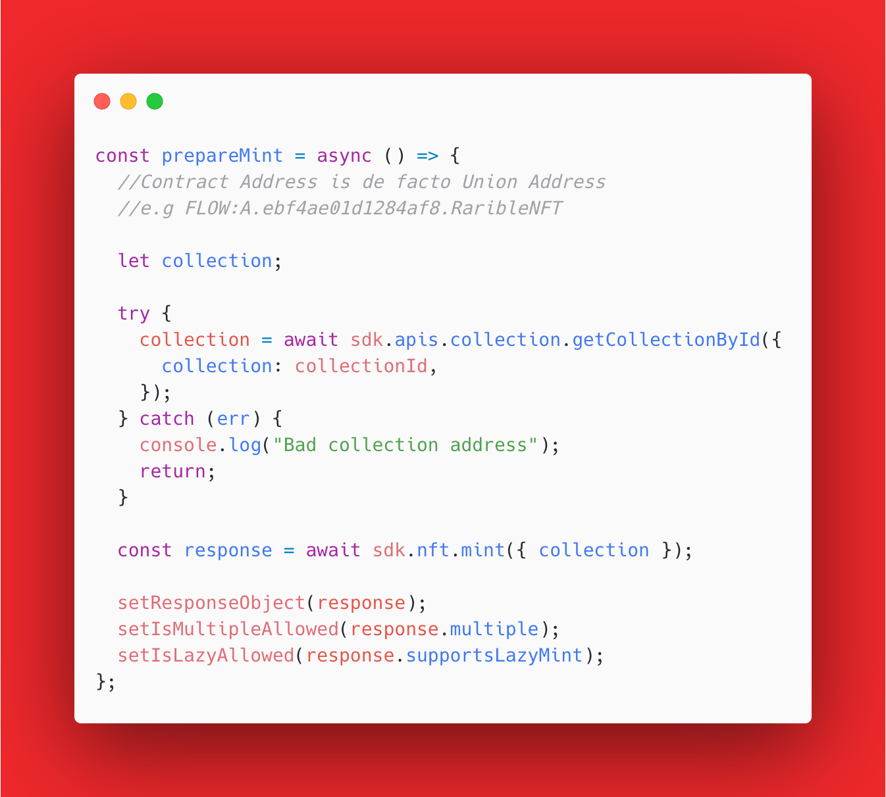
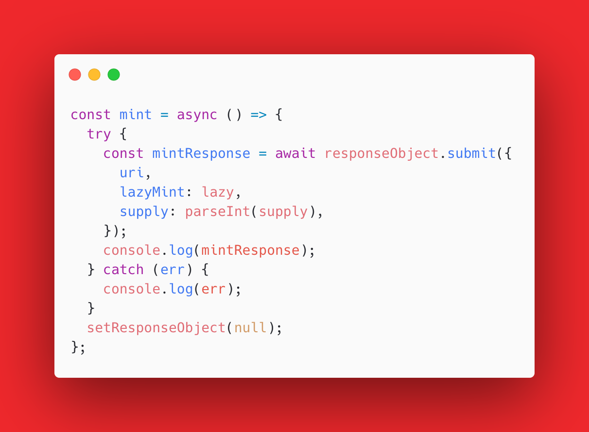

# How to create NFTs on Flow Blockchain using Rarible Protocol

If you’re looking for alternatives to the Ethereum blockchain, there are plenty of different options. One of them is Flow, a blockchain developed by the CryptoKitties and Dapper creators. It was built with scalability in mind and was tailored for intense blockchain usage.

In this article, we will walk through Flow features in more detail, talk about what makes it unique, and explore the creation of NFTs on the Flow blockchain using Rarible Protocol.

## What is the Flow Blockchain

Speaking in marketing terms, Flow is _“a fast, decentralized, and developer-friendly blockchain, designed as the foundation for a new generation of games, apps, and the digital assets that power them.”_ To be honest, after researching it for a while, it does appear so. Let’s break it down a little, and highlight all the pros.

There are **4 main reasons** why Flow is considered unique, often referenced as the **“Four Pillars”**, which are:

* Multirole architecture
* Resource-oriented programming
* Developer ergonomics
* Consumer onboarding

We’ll now break down each pillar, so you can get a better understanding of Flow blockchain.

**Multirole architecture**

On Flow, instead of every node managing everything around transactions processes (like storing the entire state), the dev team had them split into pipelines. What that means in practice is that the work is split into a few different parts, which allows the blockchain to scale dramatically.

**Resource-oriented programming**

What resources mean, in this context, is a new way of representing asset ownership. Thanks to [Cadence](https://github.com/onflow/cadence) (which is the native language of Flow’s smart contracts) — _“developers can create uniquely durable digital artifacts where ownership is tracked by the language itself, enabling a powerful new category of applications”_ ([source](https://www.onflow.org/primer)).

**Developer ergonomics**

By developer ergonomics, Flow means: developer-friendly smart contracts creation. Additionally, **smart contracts** on Flow **are upgradable**. On Flow, you are allowed to deploy a contract to mainnet in its “beta state”, allowing the authors to incrementally update the code. Users are alerted about the status of the contract and are able to choose if they want to trust it now, or only after it’s finalized.

**Consumer onboarding**

Flow puts a lot of effort on consumers. For example, ETH transactions contain very little information about the transaction itself. You just trust it, which is not ideal. On Flow, you get detailed transaction info and guarantees about what transactions can and cannot do.

In my honest opinion, **Flow does sound pretty neat**. Now it’s time to dive into how we can take advantage of it with Rarible Protocol.

## Flow contracts on Rarible Protocol

As mentioned in the introduction, I will also provide the contracts Rarible Protocol distribute on Flow. There are four of them at the time of writing.

* RaribleFee: fee manager that holds the rates and addresses fees.
* LicensedNFT: contract interface adds royalties to NFT. You can implement this LicensedNFT on your contract (along with NFT), and your royalties will be distributed when trading on [Rarible](https://rarible.com/).
* RaribleNFT: the Rarible NFT contract that implements the [Flow NFT standard](https://github.com/onflow/flow-nft) is equivalent to ERC-721 or ERC-1155 on Ethereum.
* RaribleOrder: marketplace contract is the wrapper for the standard [NFTStorefront](https://github.com/onflow/nft-storefront), handling market orders.

**Smart Contracts Addresses**

Another important thing is the address of the Smart Contract that we want to use. Currently, Rarible has 4 contracts deployed, you can see them below. If you want to copy or read them, you can find all the [information here](https://github.com/rarible/flow-contracts).

<figure markdown>
{ width="800" }
</figure>

We need those addresses because, in the Multichain SDK (which used to be called Union SDK), we’re referencing entities like collection ID, token ID by **Union Addresses,** which consists of blockchain name and address after colon, like this:

**FLOW:A.ebf4ae01d1284af8.RaribleNFT**

## How can you create NFTs on Flow using the Multichain SDK?

You can follow the [project template](https://github.com/kolberszymon/union-sdk-template) that we’ve created.

The hardest part about using the Multichain SDK is setting it up, but we’ve already done that for you on the GitHub template. Now, let's walk you through the Flow-specific aspects of the process.

**Which wallet should we use for Flow?**

The first important question is, which wallet can you use for Flow? Unfortunately, you can’t access it from Metamask. According to [official Flow suggestions](https://docs.onflow.org/flow-token/available-wallets/), there are two options:

* Blocto
* Ledger

In this example, you'll be using Blocto (which is also referenced as FCL). Create a new account, and let’s get started.

## Coding Part

Finally! It’s time for the coding part. 🥳 We will make this process as easy as possible.

**1. Choose FCL as the desired wallet in `\_app.tsx`**

<figure markdown>
{ width="800" }
</figure>

When it comes to working with the Multichain SDK, there are two things that have to be right in order for the rest to work:

* Network environment
* Multichain address

A network environment is needed for sending and signing transactions. You can treat it just like a login functionality.

Multichain addresses, on the other hand, are needed because we’re interacting with a few blockchains using one code base. So the code needs to know which blockchain (first part of the Multichain Address) and which entity (second part of the Multichain Address) we want to interact with. Values on “desired wallets” will translate to buttons on the frontend (you can style them on an sdk-wallet-connector file using the Options function), which allows users to connect with chosen blockchains.

**2. Prepare Mint**

<figure markdown>
{ width="800" }
</figure>

Get information about the way you can mint a token. Information such as:

* Is lazy minting supported?
* Is multiple minting supported?
* Is the provided collection address valid?

Remember that you can always check what’s inside a response just by consoling it out. At the end of the function, we’re storing the values which we’re interested in, within useState hooks.

**3. Minting**

<figure markdown>
{ width="800" }
</figure>

In this step, we’re submitting the response that we got in step #2. The best way to do it is to store it in the useState hook 🪝. In order to successfully mint an NFT, we also need URI, lazymint, and supply. One more thing I wanna cover in greater detail is URI.

First things first, in order to successfully display an image on Rarible, the URI has to be in the following format:

**ipfs://ipfs/{hash}**

e.g. `ipfs://ipfs/QmWLsBu6nS4ovaHbGAXprD1qEssJu4r5taQfB74sCG51tp`

The second thing is that the URI should point to a metadata object like the one shown below.

<figure markdown>
{ width="800" }
</figure>

If you want to check out what’s under your URI on IPFS, you have to merge [https://rarible.mypinata.cloud/ipfs/](https://rarible.mypinata.cloud/ipfs/) with your hash. That’s it! 😎

## Summary

In this article, we’ve walked through the process of creating NFTs with Multichain SDK, talked about how the Flow blockchain works and what makes it unique, and covered what is the proper way to store the URI.
