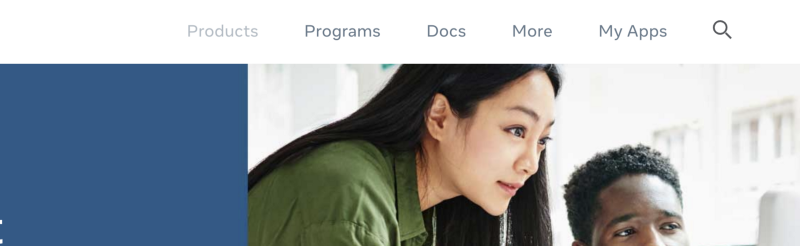
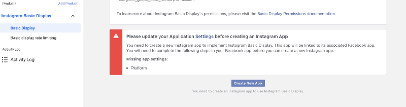
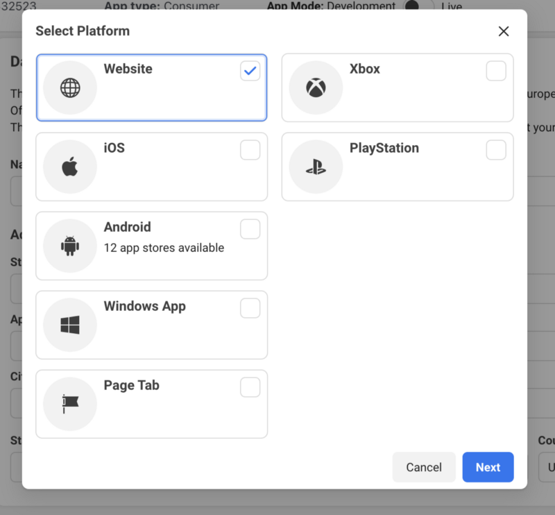
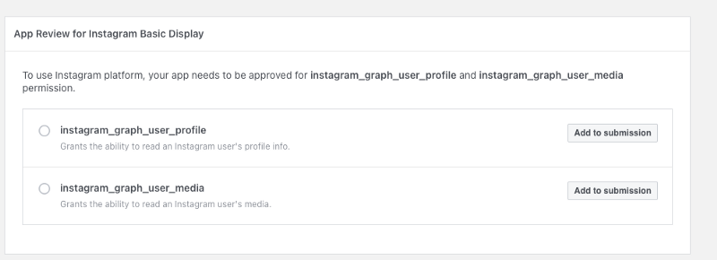
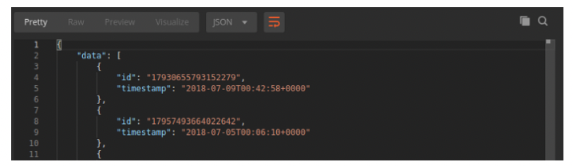
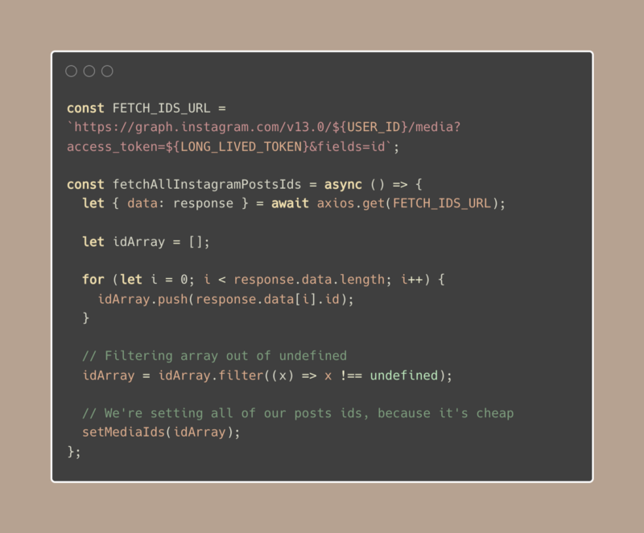
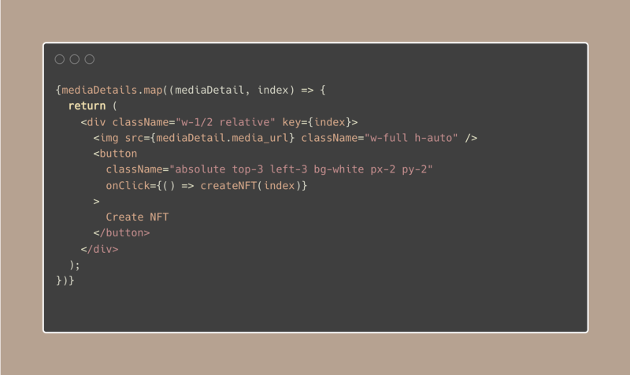

# Instagram to NFT service with Rarible Protocol. Part 1


In this tutorial, you're going to learn how you can build a [CocoNFT](../use-cases/coconft.md) clone. What is CocoNFT, you’d probably ask? It’s a service that allows you to mint your Instagram posts as NFTs.

Project is splitted into a 2 part series. Including everything into one article would feel overwhelming.

In the first part (the one you’re currently reading), we're going to explain how to let users Authorize their Instagram accounts on the app, so they can fetch their photos.

In the [second part](instagram-to-nft-part-2.md), we’re going to dive deeper into integrating the application with Metamask and many different wallets. This will allow users to interact with a bunch of different blockchains, such as Polygon, Ethereum, Flow, Tezos, to name a few. All of this will be done using Rarible Protocol APIs/SDK.

If you want to follow along with the finished code, here is the [GitHub repo](https://github.com/kolberszymon/nftig).

## Create an Instagram App that can authorize a user

Since scraping websites like Facebook or Instagram is a daunting task, it’s much easier to just use their API, because, well… they provide it. First, you have to go to the [Facebook for Developers website](https://developers.facebook.com/). There, you have to go to “My Apps”.

<figure markdown>
{ width="800" }
</figure>

Click the big green button “Create an app” (no screenshot included here, because you won’t miss it for sure).

<figure markdown>
{ width="800" }
</figure>

After that, you can choose an app type. There are quite a few different types here, but let’s select “Consumer”.

<figure markdown>
{ width="1000" }
</figure>

From here, we can set up more products. Since we’re focused on Instagram, click the “Set Up” button under the “Instagram Basic Display” option.

<figure markdown>
{ width="1000" }
</figure>

From now on, you should see Instagram’s Basic Display on the left sidebar. If you’re following this tutorial, you should also see a big red error. Don’t worry, we’re going to solve it now.

Go to Settings > Basic. You can then see App ID and App Secret. While we’re on top of the page, you should also add the Privacy Policy URL and User Data Deletion. These fields are mandatory. What’s funny is that it can be a totally fake URL (that would kinda breach the ToS of Meta and GDPR, I think). It just needs to have HTTPS and return status 200. I’m using [httpstat.us/200](https://httpstat.us/200) which is basically a tool that always returns the 200 status code.

<figure markdown>
{ width="1000" }
</figure>

There is one more thing that we have to do while we are still on the Settings / Basic page: adding a platform. Localize a big “ Add Platform” button on the bottom, click on it, and you should see the following popup. Select the website option.

<figure markdown>
{ width="800" }
</figure>

Add a website URL.

<figure markdown>
{ width="400" }
</figure>

After we filled in all required URLs and added a platform, we are able to create a New App on Instagram Basic Display.

<figure markdown>
{ width="1000" }
</figure>

You’ll need to provide the correct URLs. This step is very important, because the Valid OAuth Redirect URI is an address where the Instagram Authorize window will redirect you with the Authorization Token as a query parameter. So in an ideal scenario, you would pass your backend API address here, save the token in the database, and then redirect the user to the proper page.

<figure markdown>
{ width="600" }
</figure>

The next step is to add the following options to submission. They are required to allow us to fetch user data.

<figure markdown>
{ width="800" }
</figure>

Okay, the setup step is already done… almost 🥰.

You also have to add an Instagram test user to be able to use the Instagram API in development mode. You can do it by going to Roles / Roles on the sidebar, and adding Instagram testers.

<figure markdown>
{ width="800" }
</figure>

Finally… the last step. You have to agree on becoming a test user. You can do it by going to Instagram > Settings > Apps and Websites.

<figure markdown>
{ width="800" }
</figure>

That’s the end of the 1st section. You’ve learned:

* How to create a Facebook App
* How to create an Instagram App
* How to invite a Test User

## Get all necessary tokens needed to get user medias

When it comes to the tokens, we’ll need:

**1. Authorization Token** — The one we receive after informing we want to authorize our app. The Authorization Token is one-time usage only, but if you mess this step up don’t worry, you can always show it again.

<figure markdown>
{ width="400" }
</figure>

**2. Short-Lived Token** — At this stage, we have an Authorization Token, which we can trade for the Short-Lived Token. It allows us to query the Instagram API for 60 minutes! That’s where its name came from. But we can also go one step further, and trade it for…

**3. Long-Lived Token** — After obtaining it, you’re able to use it for up to 60 days. You’re also able to extend it after 24 hours from creating it. What it means in practice, is that you will not have to ask a user for an Authorization again. Big UX win! 👊

Before we learn how we can obtain it, you should prepare the two values below. They will interchange in a lot of requests.

* `APP_ID`
* `APP_SECRET`

We can get both of them on the FB For Developers Instagram Panel.

### Authorization Token

In order to retrieve the Authorization Token, first, we have to prepare the following URL:

```
https://api.instagram.com/oauth/authorize?client_id=6201234567890178&redirect_uri=https://httpstat.us/200&scope=user_profile,user_media&response_type=code
```

You’ll need a few parameters here. `client_id`,` redirect_uri`, the scope of granted access. We talked about all of them earlier. After the URL creation, simply paste it to the browser. Then, the authorize page will pop up like it was shown earlier. Click on Authorization, and it will take you to the Redirect URI, which you’ve provided, but (and that’s the fun part) with an added code parameter. An example of a URL looks like this:

```
https://httpstat.us/200?code=AQBvJwCZtYdj1zLH_5myoAA1GRRpDhs1vcHFMzB4gvRk6dLkq5dNd24EVZ5FD9WoqQhfSuo6arUB17MPu2gRqEzP6EpsAl-9_2eC9-L6mWYQdWDyarkwDSNEs8T3gvoH-WLMHzhwwd6DJqP5PxJGf2ve53m7aGMEua3MzV8FZQVz5AfwWPN3G87n25jMBGgGGVj6G4pxJ9HqzNKmdpYK8GHKnRn_G03scHtUraFlEX5faCvz6ZO7Xw#_
```

This is the code we require, so copy it and delete the last two characters, “#\_” to be precise. They are always added, and you have to delete them.

### Short-Lived Token

In order to obtain this one, we’ll need to do a POST request with form data added. We’ll need:

* `CLIENT_ID` — which you can grab on FB For Developers / Instagram Display Page, it’s called App ID on the page
* `CLIENT_SECRET` — same as above, only it’s located to the right
* `GRANT_TYPE` — “authorization_code”
* `REDIRECT_URI` — redirection URI which you’ve provided
* `CODE` — authorization token which we obtained in the previous step

If you’re using Postman, which I highly recommend for doing HTTP requests, your page should look similar to mine. Names in between curly braces are called Environment Variables. You can set them in global, and reuse them throughout the app.

```
https://api.instagram.com/oauth/access_token
```

<figure markdown>
{ width="800" }
</figure>

After sending a successful request, you should see the following answer.

<figure markdown>
{ width="600" }
</figure>

If you mess something up, just read the error description and repeat the step to obtain the Authorization Token. Remember that it can only be used once. Going back to response values, `access_token` is our short-lived token, and `user_id` is, well, our user ID. It doesn’t change at all, so you can also store it in the Global Vars on Postman.

Congratulations! You’re now able to fetch user data! For now, it’s valid only for 60 minutes, so let’s work on that right now.

### Long-Lived Token

In order to change the Short-Lived Token into the Long-Lived one, you’re going to have to do a GET request to this address:

```
https://graph.instagram.com/v13.0/access_token?client_secret={{APP_SECRET}}&access_token={{ACCESS_TOKEN}}&grant_type=ig_exchange_token
```

<figure markdown>
{ width="600" }
</figure>

In exchange, you’ll get a self-explanatory response. Grab an access_token value, and you’re good to go. You have a Long-Lived Token, now!

<figure markdown>
{ width="600" }
</figure>

## Fetch media details

We’ve come a long way, but we’re finally here! After creating an Instagram App and getting a Long-Lived Token, we’re now ready to do some coding.

Since we don’t really have an HTTPS on localhost, we’ll just use an `access_token` straight from the code. If you’d like to go live with that, you just need to change a few things. Maybe create some sort of backend API, replace the Instagram Redirect URI to your website’s one, and take it from there. This is just for tutorial purposes, so I won’t do that here. Of course, there are a lot of different ways to achieve the same goal, so it’s better to focus on concepts here.

The URLs which you’ll need in order to get those data are:

**1. Fetch IDs of user media**

```
https://graph.instagram.com/v13.0/{{USER_ID}}/media?access_token={{LONG_LIVE_TOKEN}}&fields=id,timestamp
```

<figure markdown>
{ width="800" }
</figure>

Ids are the `MEDIA_ID`.

**2. Fetch media URL, using previously obtained IDs**

```
https://graph.instagram.com/v13.0/{{MEDIA_ID}}/media?access_token={{LONG_LIVE_TOKEN}}&fields=media_url,media_type
```

Where `MEDIA_ID` are the IDs fetched earlier.

Finally, — here comes my favourite part: 

**To the code soldiers!** 🥳

Compared to the work that we’ve already done, it will be pretty quick.

**1. Fetch IDs of users’ media**

<figure markdown>
{ width="800" }
</figure>

**2. Fetch portion of retrieved posts**

Since there is an API requests rate limit, which equals 200 requests per hour per token, I prefer to fetch posts in portions when a user actually wants to fetch more than X. Thanks to that, we’re saving our requests rate, as well as internet throughput.

<figure markdown>
{ width="800" }
</figure>

**3. Display fetched media**

<figure markdown>
{ width="800" }
</figure>

In the final step, you just have to map the media details array and use `media_url` as an image source.

## Summing it up

We know that the article was quite big, but look how much you've done. You’ve created an Instagram App, set it up, authorized a user, created a long-lived token, fetched IDs of users’ media, got media URLs, and in the final step, displayed it.

Feel free to read it again, especially the token creation part, just to understand better how the flow works.

In the [second part](instagram-to-nft-part-2.md), you'll implement the NFT creation out of Instagram posts.
