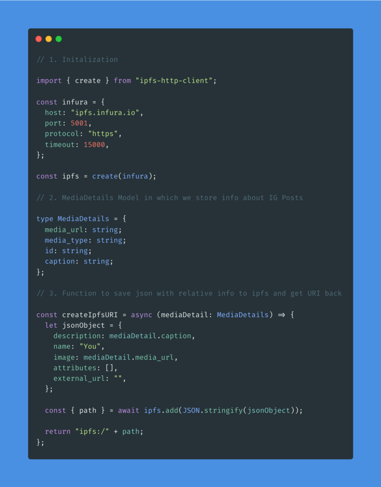

**Welcome!**

Let’s continue our journey to create a CocoNFT clone, a service that allows you to connect your Instagram and mint your posts as NFTs. Today, we are going to work on the process of creating NFT’s out of the Instagram posts.

**Table of contents:**

**1. Setting up a connector**

**2. Creating a SdkWalletConnector wrapper**

**3. Creating an SDKContext**

**4. Wrapping an app in SdkWalletConnector as well as in an SDKContext**

**5. Using an SDK to mint an NFT**

### Setting up a connector

When it comes to the `connector-setup.tsx` file, there aren’t many changes you’ll need to perform. It’s important, though, to know what’s happening. In this file, we set up available wallets. All available providers and their implementation can be found[ here](https://github.com/rarible/sdk/tree/master/packages/connector#usage-with-rarible-sdk). We’ve included just the Metamask and FCL wallet for the sake of simplicity. The most critical variable in this file is a “connector”, which allows us to connect to the desired wallets. As you can see, we create it with injected and state variables, and then, in case we want to add other options, we call add on the method chain. Summing it up, I think that it’s safe to say that we use a connector only to initialize wallet implementations and export them so that we can use them elsewhere.

### Creating SdkWalletConnector Wrapper

In the **SdkWalletConnector** element, the most important is the "if" statement. Here, we can control what we display in different connection statuses. For example, if the connection status is either disconnected or connecting, we display the option’s element, which is responsible for showing the wallet connect buttons. It’s essential to remember that we will wrap a whole app in this element because we want to have access to the SDK in every place. This means that the child element which we’re passing as an argument is basically the page.

Let’s have a short recap of what we’ve gone through so far. If the connection status is either “disconnected” or “connecting” on the screen, we’ll see only the connect buttons because we’re not displaying the child element here.

The option element is pretty simple. We take all we added to connector wallets (what we added to Connector.create(injected, state). add(fcl) ), and iterate through them. If you would like to create a unique button style for every wallet, you should use the “option” key from objects, which we get back from the connector.getOptions() function.

Going back to the if statement, in case we manage to successfully connect to the wallet, we create an SDK and display a disconnect button in accordance with the child element, which is our page.

### Creating SDKContext

Since we want to be able to use SDK on every page, we elevate the possibilities that React gave us and create a context object.

### Wrapping an app in a SdkWalletConnector as well as in an SDKContext

It’s time to put everything we’ve already created in place. First, we wrap the whole app in a SdkWalletConnector, since it’s the element that creates an SDK for us. After that, we pass the SDKContext which allows us to use the SDK out of the box in all of our pages. Then, we simply pass a Component element.

### Using an SDK to mint an NFT

If you had the chance to read my previous article/articles, this part will probably look familiar to you. Let’s start the coding journey once again! Since this article is only dedicated to the NFT creation part, we won’t cover the code from[ the first part](https://medium.com/p/164e1fb9569c).

First and foremost, we need an IPFS connection in order to be able to save our NFT on IPFS.

The process of adding data to IPFS is pretty straightforward. We’ll connect to the appropriate node (we use the infura one in this example). Then, we just wait for the add method. In the return statement, we need to append “ipfs:/” to the beginning since it’s the required format.

In this step, we do as follows:

1. Save post details on IPFS, and get its URI/CID address back;

2. Define rarible smart contract on rinkeby address;

3. Prepare mint request;

4. Call sdk.nft.mint method with previously defined mintRequest as an argument, from the response you can also get additional info about minting possibilities such as: is lazy minting enabled?, or is multiple minting enabled?;

5. Submit the response (this line will open a Metamask window, so you can sign your transaction, it’s cost-free).

**Result?**

Freshly created NFT!

If you want to check out your NFT, remember to use

[https://rinkeby.rarible.com/token/{contractAddress}:{tokenId}](https://rinkeby.rarible.com/token/%7BcontractAddress%7D:%7BtokenAddress%7D)

as a URL. For my specific example, it is:

[https://rinkeby.rarible.com/token/0x6ede7f3c26975aad32a475e1021d8f6f39c89d82:55143609719300586327244080327388661151936544170854464635146779205246455382070](https://rinkeby.rarible.com/token/0x6ede7f3c26975aad32a475e1021d8f6f39c89d82:55143609719300586327244080327388661151936544170854464635146779205246455382070?tab=details)
