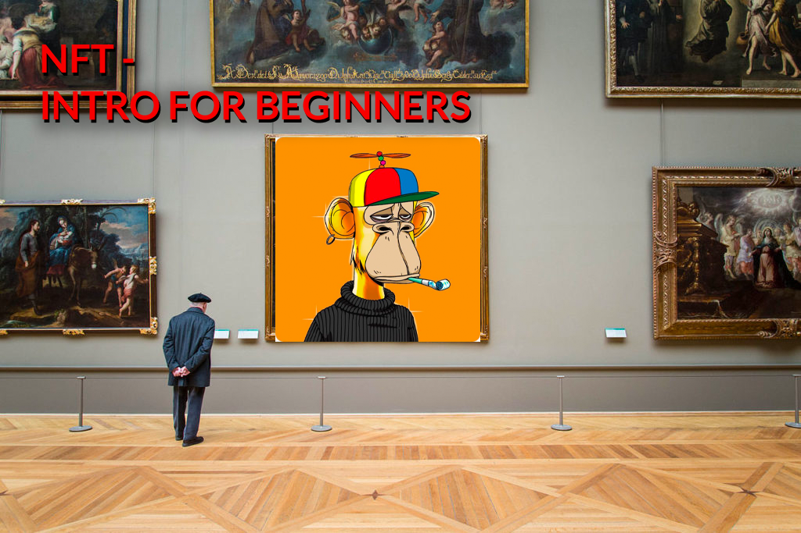
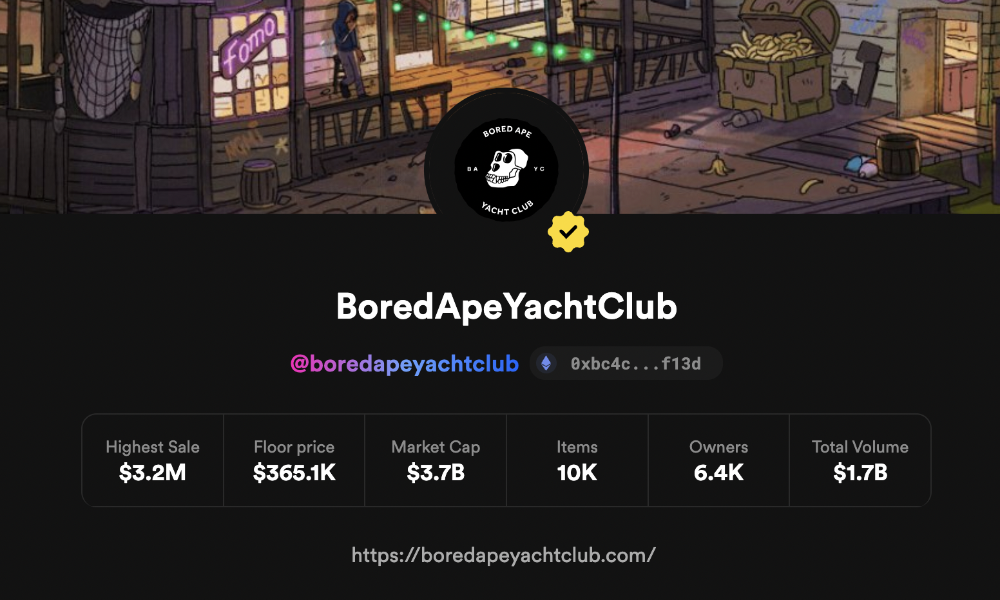
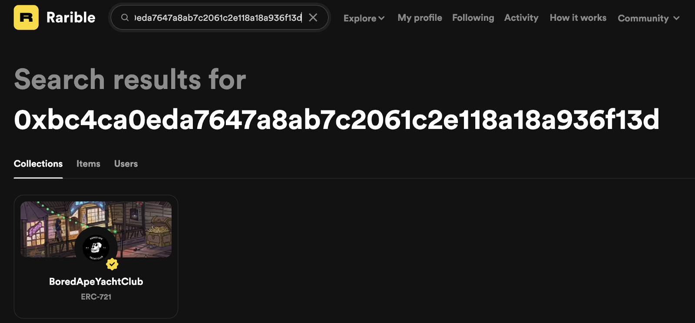
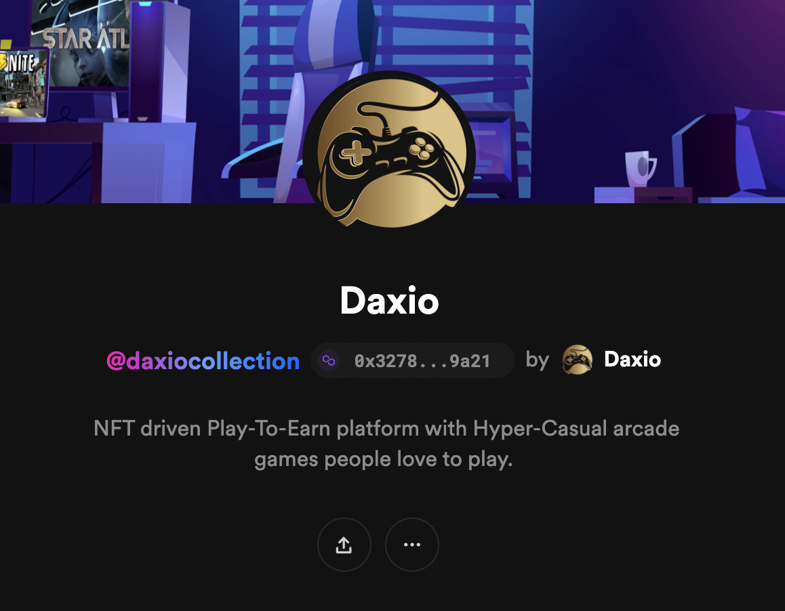

### An NFT-101 guide.

This article is a non-technical one, and its main goal is to help you feel comfortable navigating the different marketplaces and buying your first NFTs.

**Disclaimer:**

**We won’t** touch technical details here.

# Wallets

First things first. On the internet, everything that involves possession needs some sort of authentication. In a blockchain, we achieve this by using **wallets. A wallet **is a pair of private and public keys, which can be used to sign a transaction and verify your identity. The private key should always be securely stored securely, because if anyone gets it, they will be able to do anything they want with your possessions (tokens, NFTs, etc.), even take them away from you. 😨

### Metamask

Metamask is the most commonly used wallet. It’s a browser extension as well as a mobile app. You can install it on google extensions.

### Common Marketplaces

Let’s start with the question: what is an NFT marketplace after all? Every website can create its own marketplace. NFT marketplaces are nothing more than places where NFTs are accumulated and that allow users to interact and take actions towards these NFTs, e.g. buying, selling, transferring. On the marketplace, you can search for NFTs, create (or mint) them, or buy them from someone else.

Some examples of big marketplaces out there would be:

### Opensea

Opensea is the biggest NFT marketplace out there. It has all sorts of different assets, it’s free to sign up and it generally has an easy UX.

### Rarible

[Rarible](https://rarible.com/) is one of the biggest players out there. It supports NFTs on a few different chains, as well as a whole lot of different digital assets.

### There are not only big marketplaces out there

There are a ton of different marketplaces out there. As I’ve said earlier, anyone can create one. Some of them are exclusive to some use cases, like the Axie Marketplace which basically revolves around the Axie Infinity game, or NiftyGateway which works exclusively with NFT drops. There are also small, private marketplaces.[ Metaangels](https://www.metaangelsnft.com/) or [Wanderers](https://www.wanderers.ai/) can be two examples of those. Since they’re white-labeled by [Rarible](https://rarible.com/) it means that they can be trusted, are safe to use, and reliable. In any case, remember to follow your instincts and if something looks shady, it’s better to always check it a second time. You can end up with no support and no one to contact about stolen funds. We’re (currently) in the wild west, baby 😎

# NFTs properties

Okay, we already know some things about NFTs. We know that in order to create our account we will need a wallet, and we know where to find NFTs for sale. Technically speaking, we can create an NFT out of anything, but as I mentioned in the beginning this is not a technical article, so we’re gonna focus only on what you can expect to see on a usual NFT, displayed on marketplaces.

Basically, every NFT you’ll see on marketplaces will have a similar information structure. Let’s break them down even further.

### Visual asset

Almost every NFT will represent some sort of a visual asset. It can be a gif, video, mp4, 3D model, or an image.

### Title

A title is simply a name that we assign to an NFT, it doesn’t have to be unique. After all, every NFT, even if it looks exactly the same as another one, is unique on its own.

### Collection

This one is **important**. Basically, the collection allows us to know from which origin the NFT was created. As said earlier, nothing stops you from creating exactly the same NFT as someone else. Collections, on the other hand, are the guarantees of an origin. Often, they come as smart contracts created for this purpose. So you should always check the collections you’re buying from. ✅

**How can you find out if a collection is valid?**

The best way to do that, is to access the website of the project you want to buy. Let’s say it’s[ BAYC](https://boredapeyachtclub.com/#/home). You can go to their website, which you can identify thanks to the HTTPS, and you look for the marketplace’s link (here’s [Rarible](https://rarible.com/)’s). You then look for the collection address which is a hex address of the contract. It looks like this : “[0xbc4ca0eda7647a8ab7c2061c2e118a18a936f13d](https://rarible.com/boredapeyachtclub/items)”.

On [Rarible](https://rarible.com/), you can even see the verified badge, in addition to the project’s website and collection address. Basically, collections allow you to check if the NFT you want to buy is a legit, original NFT from the right author, and not a “fake Gucci”.

**How can you find the collection you’re looking for?**

If you know what you’re looking for, the best way to check if the collection is legitimate, it’s to start by looking into the project’s website. If it’s a professional, and **public** project it will have a link to its collection on marketplaces. If there’s no link there, you can always search it by name on [Rarible](https://rarible.com/). If the collection shows a lot of transactions and volume on the marketplace, it’s probably legit. If you can’t find it on the marketplace website by doing a name search, try to find its collection address. If you can’t find that too, then there’s not much you can do to verify the authenticity of that NFT.

Remember that NFTs can be spread between different marketplaces, but if you see an NFT on [Rarible](https://rarible.com/), it doesn’t mean that it’s automatically on every other marketplaces out there.

As you can see in the image above, there are plenty of different BAYC collections, but in most cases, you can easily distinguish the original from the fake one.

In the same way, you can search for a collection by using its contract address, which will return the exact collection you’re looking for.

**How to search for collections by a creator?**

This situation is identical to the previous one. Let’s say that you’re looking for NFTs from the user “Daxio”. You can identify him by his username or wallet address.

On his profile, you can see his wallet address, and even on which blockchain it is. As you can see in this example, the wallet address is from the Polygon blockchain.

### Attributes

Attributes are additional properties that creators can add to the NFT. If they’re creating an NFT game, maybe they can add strength or agility properties that will represent some functions in the app.

# NFT ownership

The owner of the NFT is actually the wallet address where that NFT is located at the moment. Ownership can change, of course, simply by selling that NFT, transferring it, or burning it.

### How to check NFT overall ownership

**1. Using marketplaces**

On [Rarible](https://rarible.com/), you can scan through the NFT using the order book that exists for every NFT out there. You can see who was the previous owner, how much it was sold for in the past, and what are the current bids to that NFT. A lot of useful information about everything that happened to that NFT in the past.

**2. Using etherscan**

If you’re interested in knowing all of the transactions of a given NFT, you can also do it by checking it on [etherscan](https://etherscan.io/). It’s simple, but in order to accomplish that we’ll need two things — the token id and contract address. We can get both from URL. Let’s use this as an example:[ https://rarible.com/token/0xbc4ca0eda7647a8ab7c2061c2e118a18a936f13d:6416?tab=details](https://rarible.com/token/0xbc4ca0eda7647a8ab7c2061c2e118a18a936f13d:6416?tab=details)

As you can see, we have token/contract_address:tokenId. So in this case, the contract address is 0xbc4ca0eda7647a8ab7c2061c2e118a18a936f13d and token Id is 6416. After getting those, we can then check the NFT on etherscan. You can do it by searching through transactions on given collections, but it’s much easier if you just create a link by yourself which is

[**https://etherscan.io/token/contractAddress?a=tokenId**](https://etherscan.io/token/contractAddress?a=tokenId)

if we use it with the previous example, it would look like this:

[**https://etherscan.io/token/0xbc4ca0eda7647a8ab7c2061c2e118a18a936f13d?a=6416**](https://etherscan.io/token/0xbc4ca0eda7647a8ab7c2061c2e118a18a936f13d?a=6416)

And voilá, you’re now able to browse through all of the details straight from the source.
