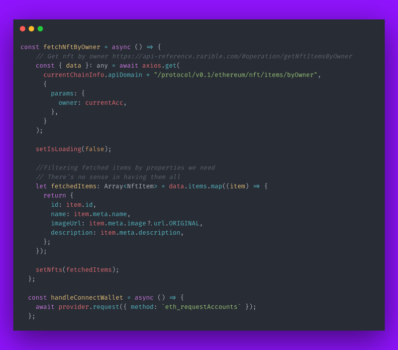
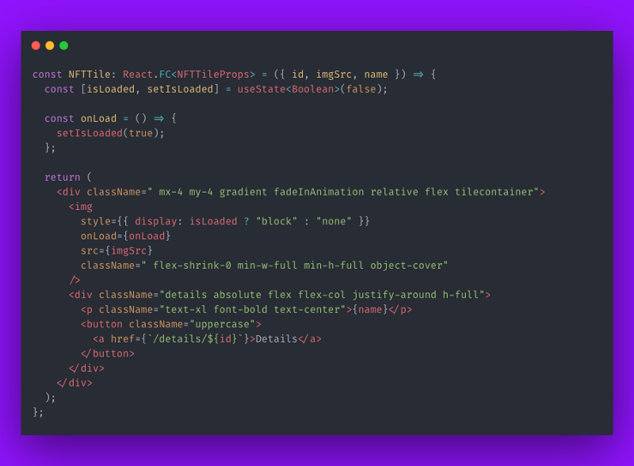
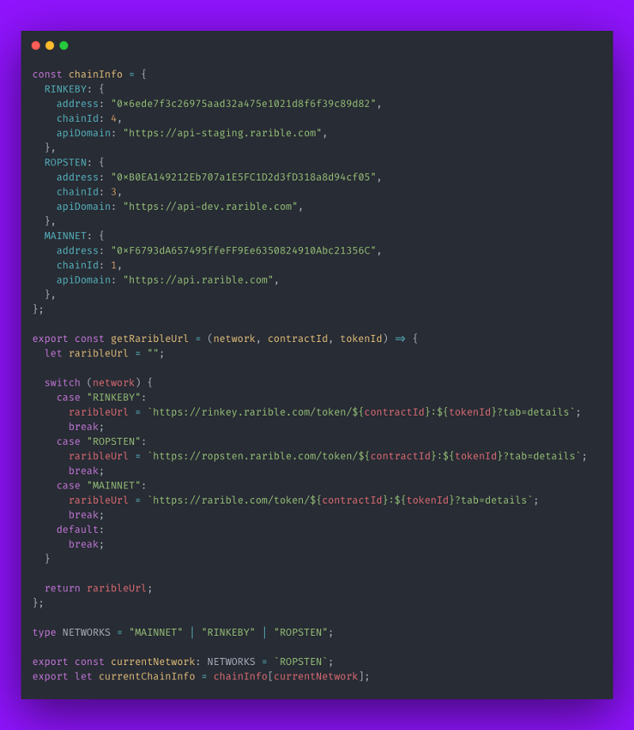
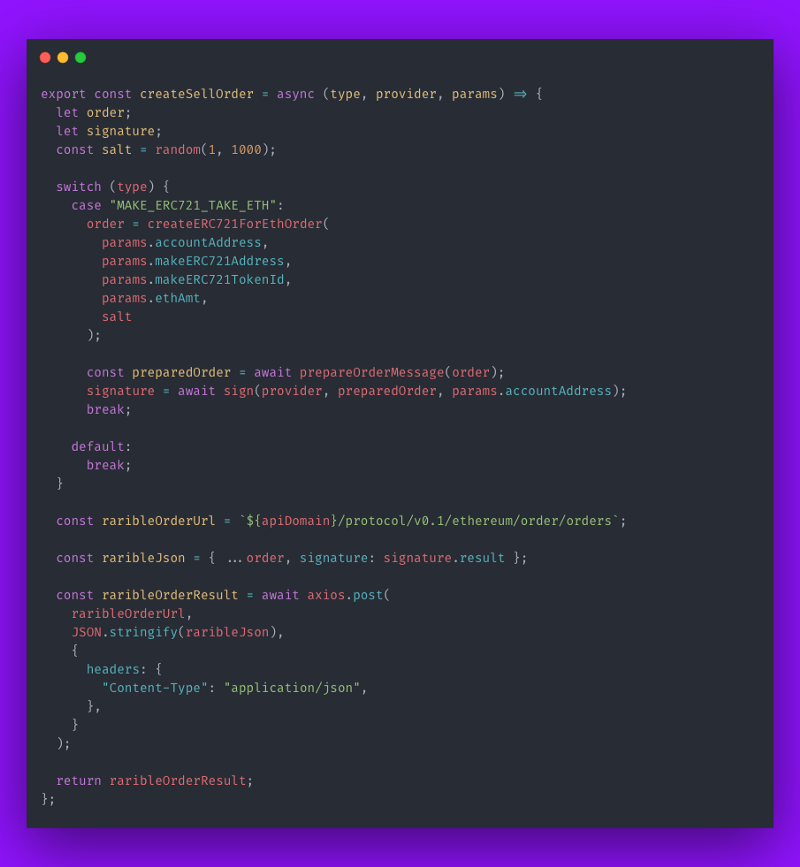
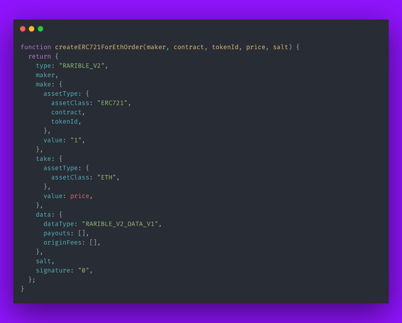
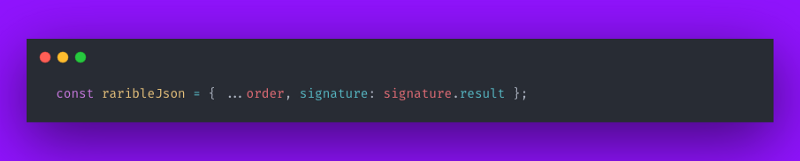

# Create an app that allows you to list and sell NFTs, in 60 minutes

In this tutorial, we’ll use the Rarible protocol to create a simple, yet very practical application. In this app, users will be able to connect their Metamask wallet, see all the NFTs they own (on the Ethereum blockchain), AND list them for sale!

Why dive deep into solidity and waste months on end developing and testing your own contract, when you can just use a complete and fully reliable solution FOR FREE? With only JS! 😄

## Without further ado, let’s dive into it!

The app has 3 screens:

**1. “Connect wallet” button screen**

<figure markdown>
{ width="300" }
</figure>

Since the functionality of our app is limited (showing only NFTs that are owned by the user), there’s no need to show anything on this 1st screen if the user hasn’t yet connected his/her wallet. This functionality is tied to events, so anytime a wallet is connected or disconnected, the content on the screen will be refreshed.

**2. “See your NFTs” screen**

<figure markdown>
{ width="600" }
</figure>

The main screen of our app. We’re using a nice loading technique, which shows pictures only after they are fully loaded (bonus: we're gonna show you how to do this also).

**3. “List your NFT for sale” screen**

<figure markdown>
{ width="600" }
</figure>

Here, we can create a sell order which can be accepted by others. The buyer will be able to sign the transaction, exchanging ETH tokens to the NFT ownership.

If you’re more comfortable working with code by your side, here is the GitHub repo link for this project:

[https://github.com/kolberszymon/nft-marketplace-tutorial](https://github.com/kolberszymon/nft-marketplace-tutorial)

Clone it and you’ll be ready to go.

## Application architecture

Let’s first talk a bit about why we are using what we are using. For the framework, we’ve chosen NextJS. It has a clear project structure and provides routing out of the box.

Every folder in the ‘pages’ folder, with an index file in it, is translated into a URL. It allows us to use the Static Site Generator [which is a super cool feature](https://www.netlify.com/blog/2020/04/14/what-is-a-static-site-generator-and-3-ways-to-find-the-best-one/), and, because NextJS is a React “relative”, we can also use context. We’ll use it to wrap our app on EthereumContext, which tracks whether a wallet is connected or not. Regarding the Type Script, we’ve mainly used it for educational purposes, so you can clearly see each type.

## “Connect Metamask” button screen

The most useful and important thing you can learn from this screen is how to properly create context. Let’s analyse it.

<figure markdown>
{ width="800" }
</figure>

As you can see, we’ve imported two react functions, `createContext` & `useContext`, to be able to create a context. After that, we define `ContextProps` which we’ll be using across our screens. (Don’t feel intimidated by that ‘Partial’ thing, it’s just a way to create an empty context object in TypeScript 😉).

We export `EthereumContext`, as well as `useEthContext`. `EthereumContext` will be needed to wrap an app component in it, and useEthContext will be used to retrieve currently stored values.

Let’s take a look at the `\_app.tsx` file, which is the main file for NextJS apps.

<figure markdown>
{ width="800" }
</figure>

As you can see, there are 2 `useEffect` here: one with an empty dependency array, and one watching web3 changes. The first one is responsible for checking if our browser supports web3 (in other words, it checks if Metamask is installed and if the window has an Ethereum global variable). If it doesn’t, we create an event listener which will be triggered when Ethereum is initialised.

The second one, allows us to always refresh the currently selected account when web3 changes.

<figure markdown>
{ width="800" }
</figure>

The procedures above represent a pretty standard way to start a crypto project. We [destructure](https://developer.mozilla.org/en-US/docs/Web/JavaScript/Reference/Operators/Destructuring_assignment) the Ethereum property out of window objects, and then check if it’s defined and if it’s Metamask. After that, we set an event listener on the Ethereum object to set accounts, **every time we switch an account or disconnect it.** And last but not least, we set the web3 object.

As you can see, `setCurrentlyConnectedAccount` is used strictly for refreshing purposes. It gets your Metamask accounts, and if it finds any, it sets the first one in the array as the currently used one. The first item on the list, returned from the `getAccounts` function, is always the currently chosen one.

Now comes the best part: `\_app.tsx` file.

<figure markdown>
{ width="800" }
</figure>

All the hard work to set things up, paid off. Now, we just elegantly wrap the app on `EthereumContext.Provider`, pass in values previously defined, which will update automatically in case anything changes (since we’ve set event listeners on those), and voilà! We don’t have to worry about wallets anymore, the rest is strictly NFT related! 🤩

## “See your NFTs” screen

Now, we’ll learn how we can list owned NFTs. If you are working with Rarible, [you can find the API documentation here](https://multichain-api.rarible.org/v0.1#operation/getItemsByOwner). We will use the `getItemsByOwner` endpoint.

<figure markdown>
{ width="800" }
</figure>

We first define the `NftItem` type. There are many more properties than these ones, as you can see on the screen of API response, but these four will suit our needs.

<figure markdown>
{ width="400" }
</figure>

Pay attention to how we are using EthContext here. ✨

<figure markdown>
{ width="800" }
</figure>

These are all the logic needed in order to show owned NFTs. Thanks to Rarible API, you can literally do it in only a few lines. First, we need to fetch data from the Rarible API and, afterwards, map through a returned list in order to adjust it to the NftItem type. The `handleConnectWallet` button is used to connect your Metamask account. Yep, that’s how you do it, with only ONE line of code!!! People are often scared of Web3, but actually coding in it is pretty simple…

<figure markdown>
{ width="800" }
</figure>

Let’s wrap up the HTML rendering! We have three states here: not connected, connected but NFTs are not fetched yet, and ready. We show only what is needed. In the last case, we map all the NFTs, and render tiles for each one.

Here’s the **bonus**! If you want to create an image that will shimmer until it’s fully loaded, this is how you do it:

<figure markdown>
{ width="800" }
</figure>

Create an isLoaded state, which defines the img display type. If it’s not loaded yet, it is set to none, otherwise it’s a block type. Images have onLoad property which allows us to do something when the image is fully loaded. In this case we’re simply setting isLoaded to true, which copes with our previous logic.

<figure markdown>
{ width="800" }
</figure>

The CSS for this animation looks like this. You can find every source on github. Feel free to get “inspired” by that. And, yeah, by “get inspired” we've meant ++ctrl+c++ , ++ctrl+v++ . 😛

## “List your NFTs for sale” screen

Okay, here is the most interesting part of this tutorial: how can we list an NFT for sale using Rarible? Let’s see:

<figure markdown>
{ width="800" }
</figure>

We’re passing tokenId in the URL, so first, we need to retrieve it by using the next router. If `tokenId` exists, i.e. if somebody didn’t pass the wrong URL, we’ll fetch `tokenData` and `tokenSellOrder`. Unfortunately, these are two different endpoints, so we can’t fetch token price and info in one request. Now let’s move onto something very important, that can probably save you some time.

<figure markdown>
{ width="800" }
</figure>

On Rarible, there are different endpoints depending on what chain you’re currently using. Since we mostly use a testing chain for development purposes, it will rarely be api.rarible.com. All you have to do is specify the current network by choosing one from `NETWORKS` enum. You also have to import the `currentChainInfo` variable and use it.

Hang on, we are almost done!!!

<figure markdown>
![Button handler in [tokenId].tsx](./img/nft_app_17.png){ width="800" }
</figure>

The button handler is pretty simple, since we have a good code structure. Here, we basically pass all the needed arguments and delegate it to the `createSellOrder` function.

<figure markdown>
{ width="800" }
</figure>

There are a few types of sell orders, but in this case we’re choosing `MAKE_ERC721_TAKE_ETH`, which literally means: I want to receive ETH tokens in exchange for my ERC-721 NFT.

<figure markdown>
{ width="800" }
</figure>

In order to create a sell order, we have to provide the type of object that will match the request schema (this is[ based on EIP712](https://eips.ethereum.org/EIPS/eip-712)). It’s a basic ‘copy and paste’ mechanic, so you can’t innovate too much in this part.

After the object is created, we now want to sign it.

<figure markdown>
{ width="800" }
</figure>

I know it looks odd at first glance, but it really isn’t! Let’s walk through it.

First, we just ‘stringfy’ our data. In a nutshell, we’re sending bytes to the contract so the object has to be in the form of a string. Then, we use a provider which, in our case, is Metamask, to allow the user to sign the transaction. Sig variable is all we need from this function.

We’ve created a template for our data in the form of an object, stringfied it to JSON format, signed it with Metamask and… that’s basically it. We just have one last thing to do: add a signature. We’re adding it to order, like this:

<figure markdown>
{ width="800" }
</figure>

and we’re ready to POST it!

We’ve include `raribleJson` as request body, set headers to `applicaction/json` and everything is ready. That’s it! From now on, it is already saved on Rarible, so if we want to interact with that we do it through API requests. 😊

## Summary

It wasn’t that hard, was it? In this tutorial we’ve created a place to see your NFTs, as well as list them for sale. To do that, we used Rarible, which allows us to interact with smart contracts 100% through their API.
