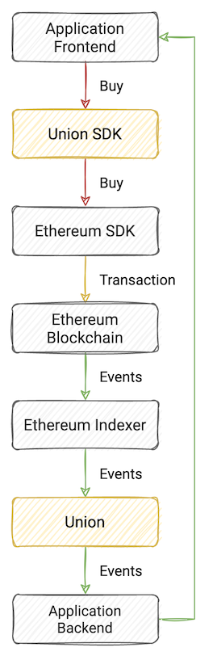

# Example app

Start with [Rarible Protocol SDK](https://github.com/rarible/sdk).

Also, you can create a [Protocol Example App](https://github.com/rarible/protocol-example/) for a quick start.

In this example, you can:

- Configure Rarible SDK
- Create Lazy mint NFT item
- Create sell order
- Purchase (buy item) an order
- Get your NFT from your current wallet

Also, you can try [scaffold-eth Rarible Starter App](https://github.com/ipatka/scaffold-eth/tree/rarible-starter-app).

## Example of NFT purchase flow

1. Click buy NFT in the app.
2. The frontend calls the Buy function in the Union SDK.
3. Union SDK calls the Buy function in the SDK of the desired network.
4. SDK prepares and sends the transaction to the underlying blockchain.
5. Indexer listens to purchase, transfer events, updates NFT state internally.
6. Indexer transmits the event to Union.
7. Union sends the information about the event to the backend of the application.

