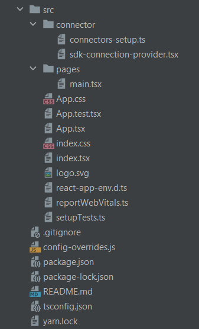
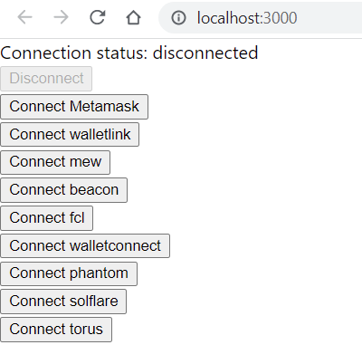
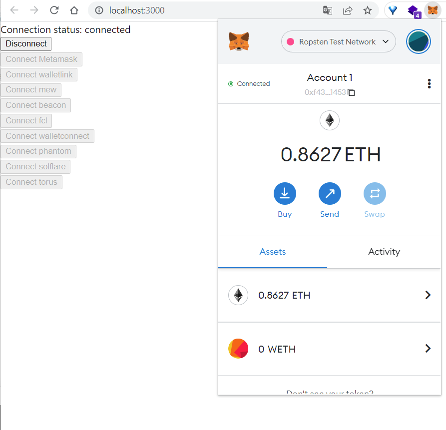

# Rarible SDK React Example App

This example will help you get started with the Rarible SDK. It is written using React.

You can try our prepared [Example APP](https://github.com/rarible/sdk/tree/master/packages/example) with advanced functionality.

## Create React App

In the beginning, you will need to have [Node.js](https://nodejs.org/en/) and [Yarn](https://classic.yarnpkg.com/en/docs/install) on your machine to [create](https://create-react-app.dev/docs/adding-typescript/) a new single-page application in React. Also, we will be use Typescript template.

To create a project, run:

```shell
yarn create react-app my-app --template typescript
```

Go to the project folder:

```shell
cd my-app
```

## Install dependencies

Our Example App will use some dependencies. To install them, run:

```shell
yarn add @rarible/connector @rarible/connector-helper @rarible/connector-beacon @rarible/connector-fcl \
         @rarible/connector-fortmatic @rarible/connector-iframe @rarible/connector-mew \
         @rarible/connector-phantom @rarible/connector-portis @rarible/connector-solflare \
         @rarible/connector-torus @rarible/connector-walletconnect \
         @rarible/connector-walletlink @rarible/sdk @rarible/types
```

## Connectors setup

Create the `src/connector` folder and `connectors-setup.ts` file there. It lists all the wallets that our application can connect to.

??? example "connectors-setup.ts"

    ```typescript
    import { NetworkType as TezosNetwork } from "@airgap/beacon-sdk"
    import { RaribleSdkEnvironment } from "@rarible/sdk/build/config/domain"
    import {
    	ConnectionProvider,
    	Connector,
    	IConnectorStateProvider,
    	InjectedWeb3ConnectionProvider,
    } from "@rarible/connector"
    import { FclConnectionProvider } from "@rarible/connector-fcl"
    import { MEWConnectionProvider } from "@rarible/connector-mew"
    import { BeaconConnectionProvider } from "@rarible/connector-beacon"
    import { TorusConnectionProvider } from "@rarible/connector-torus"
    import { WalletLinkConnectionProvider } from "@rarible/connector-walletlink"
    import { WalletConnectConnectionProvider } from "@rarible/connector-walletconnect"
    import { PhantomConnectionProvider } from "@rarible/connector-phantom"
    import { SolflareConnectionProvider } from "@rarible/connector-solflare"
    import type { IWalletAndAddress } from "@rarible/connector-helper"
    import { mapEthereumWallet, mapFlowWallet, mapSolanaWallet, mapTezosWallet } from "@rarible/connector-helper"
    // import { FortmaticConnectionProvider } from "@rarible/connector-fortmatic"
    // import { PortisConnectionProvider } from "@rarible/connector-portis"
    
    
    const ethereumRpcMap: Record<number, string> = {
    	1: "https://node-mainnet.rarible.com",
    	3: "https://node-ropsten.rarible.com",
    	4: "https://node-rinkeby.rarible.com",
    	17: "https://node-e2e.rarible.com",
    	137: "https://polygon-rpc.com",
    	80001: "https://rpc-mumbai.matic.today"
    }
    
    const ethereumNetworkMap: Record<number, string> = {
    	1: "mainnet",
    	3: "ropsten",
    	4: "rinkeby",
    	17: "e2e",
    	137: "polygon",
    	80001: "mumbai"
    }
    
    function environmentToEthereumChainId(environment: RaribleSdkEnvironment) {
    	switch (environment) {
    		case "prod":
    			return 1
    		case "dev":
    			return 3
    		case "e2e":
    			return 17
    		case "staging":
    		default:
    			return 4
    	}
    }
    
    function environmentToFlowNetwork(environment: RaribleSdkEnvironment) {
    	switch (environment) {
    		case "prod":
    			return {
    				network: "mainnet",
    				accessNode: "https://access.onflow.org",
    				walletDiscovery: "https://flow-wallet.blocto.app/authn",
    			}
    		case "dev":
    		case "e2e":
    		case "staging":
    		default:
    			return {
    				network: "testnet",
    				accessNode: "https://access-testnet.onflow.org",
    				walletDiscovery: "https://flow-wallet-testnet.blocto.app/authn",
    			}
    	}
    }
    
    function environmentToTezosNetwork(environment: RaribleSdkEnvironment) {
    	switch (environment) {
    		case "prod":
    			return {
    				accessNode: "https://tezos-node.rarible.org",
    				network: TezosNetwork.MAINNET
    			}
    		case "dev":
    		case "e2e":
    		case "staging":
    		default:
    			return {
    				accessNode: "https://test-tezos-node.rarible.org",
    				network: TezosNetwork.ITHACANET
    			}
    	}
    }
    
    const state: IConnectorStateProvider = {
    	async getValue(): Promise<string | undefined> {
    		const value = localStorage.getItem("saved_provider")
    		return value ? value : undefined
    	},
    	async setValue(value: string | undefined): Promise<void> {
    		localStorage.setItem("saved_provider", value || "")
    	},
    }
    
    export function getConnector(environment: RaribleSdkEnvironment): Connector<string, IWalletAndAddress> {
    	const ethChainId = environmentToEthereumChainId(environment)
    	const ethNetworkName = ethereumNetworkMap[ethChainId]
    	const isEthNetwork = ["mainnet", "ropsten", "rinkeby"].includes(ethNetworkName)
    	const flowNetwork = environmentToFlowNetwork(environment)
    	const tezosNetwork = environmentToTezosNetwork(environment)
    
    	const injected = mapEthereumWallet(new InjectedWeb3ConnectionProvider())
    
    	const mew = mapEthereumWallet(new MEWConnectionProvider({
    		networkId: ethChainId,
    		rpcUrl: ethereumRpcMap[ethChainId]
    	}))
    
    	const beacon: ConnectionProvider<"beacon", IWalletAndAddress> = mapTezosWallet(new BeaconConnectionProvider({
    		appName: "Rarible Test",
    		accessNode: tezosNetwork.accessNode,
    		network: tezosNetwork.network
    	}))
    
    	const fcl = mapFlowWallet(new FclConnectionProvider({
    		accessNode: flowNetwork.accessNode,
    		walletDiscovery: flowNetwork.walletDiscovery,
    		network: flowNetwork.network,
    		applicationTitle: "Rari Test",
    		applicationIcon: "https://rarible.com/favicon.png?2d8af2455958e7f0c812"
    	}))
    
    	let torus = undefined
    	if (isEthNetwork) {
    		torus = mapEthereumWallet(new TorusConnectionProvider({
    			network: {
    				host: ethNetworkName
    			}
    		}))
    	}
    
    	const walletLink = mapEthereumWallet(new WalletLinkConnectionProvider({
    		networkId: ethChainId,
    		estimationUrl: ethereumRpcMap[ethChainId],
    		url: ethereumRpcMap[ethChainId]
    	}, {
    		appName: "Rarible",
    		appLogoUrl: "https://rarible.com/static/logo-500.static.png",
    		darkMode: false,
    	}))
    
    	const walletConnect = mapEthereumWallet(new WalletConnectConnectionProvider({
    		rpc: ethereumRpcMap,
    		chainId: ethChainId,
    	}))
    
    	const phantomConnect = mapSolanaWallet(new PhantomConnectionProvider())
    	const solflareConnect = mapSolanaWallet(new SolflareConnectionProvider({
    		network: environment === "prod" ? "mainnet-beta" : "devnet"
    	}))
    
    	// Providers required secrets
    	// const fortmatic = mapEthereumWallet(new FortmaticConnectionProvider({ apiKey: "ENTER", ethNetwork: { chainId: 4, rpcUrl: "https://node-rinkeby.rarible.com" } }))
    	// const portis = mapEthereumWallet(new PortisConnectionProvider({ appId: "ENTER", network: "rinkeby" }))
    
    	const connector = Connector
    		.create(injected, state)
    		.add(walletLink)
    		.add(mew)
    		.add(beacon)
    		.add(fcl)
    		.add(walletConnect)
    		.add(phantomConnect)
    		.add(solflareConnect)
    	// .add(portis)
    	// .add(fortmatic)
    
    	if (torus) {
    		return connector.add(torus)
    	}
    
    	return connector
    }
    
    ```

## Connection provider

Create the `sdk-connection-provider.tsx` file in `src/connector` folder. Connection provider needed for handling blockchain wallet connection and pass connection and SDK objects to React context for using them in any app components.

??? example "sdk-connection-provider.tsx"

    ```typescript
    import React, { useEffect, useState } from "react"
    import { createRaribleSdk } from "@rarible/sdk"
    import type { ConnectionState } from "@rarible/connector"
    import { getStateDisconnected, IConnector } from "@rarible/connector"
    import { IRaribleSdk } from "@rarible/sdk/build/domain"
    import type { IWalletAndAddress } from "@rarible/connector-helper"
    import { RaribleSdkEnvironment } from "@rarible/sdk/build/config/domain"
    import { getConnector } from "./connectors-setup"
    
    export interface IConnectorContext {
    	connector?: IConnector<string, IWalletAndAddress>
    	state: ConnectionState<IWalletAndAddress>
    	sdk?: IRaribleSdk
    	walletAddress?: string
    }
    
    export const ConnectorContext = React.createContext<IConnectorContext>({
    	connector: undefined,
    	state: getStateDisconnected(),
    	sdk: undefined,
    	walletAddress: undefined
    })
    
    const environment: RaribleSdkEnvironment  = "development"
    
    export function SdkConnectionProvider({children}: {children: React.ReactNode}) {
    	const [context, setContext] = useState<IConnectorContext>()
    	const [sdk, setSdk] = useState<IRaribleSdk>()
    	const connector = getConnector(environment)
    
    	useEffect(() => {
    		const subscription = connector.connection.subscribe(s => {
    			const sdkInstance = s.status === "connected" ? createRaribleSdk(s.connection.wallet, environment) : undefined
    			setSdk(sdkInstance)
    			const computedContext: IConnectorContext = {
    				connector,
    				state: s,
    				sdk,
    				walletAddress: s.status === "connected" ? s.connection.blockchain + ":" + s.connection.address : undefined,
    			}
    			setContext(computedContext)
    		})
    		return () => subscription.unsubscribe()
    //eslint-disable-next-line react-hooks/exhaustive-deps
    	}, [])
    
    	return <ConnectorContext.Provider value={context!}>
    		{children}
    	</ConnectorContext.Provider>
    }
    ```

## Usage in APP

Create the `src/pages` folder and `main.tsx` file there. This will be the main page of our application.

??? example "main.tsx"  

    ```typescript
    import React, { useContext, useEffect, useState } from "react"
    import { ConnectorContext } from "../connector/sdk-connection-provider"
    import { ProviderOption } from "@rarible/connector"
    import type { IWalletAndAddress } from "@rarible/connector-helper"
    import { toOrderId } from "@rarible/types"
    
    export function MainPage() {
    	const [options, setOptions] = useState<ProviderOption<string, IWalletAndAddress>[]>([])
    	const connection = useContext(ConnectorContext)
    
    	useEffect(() => {
    		connection?.connector?.getOptions().then(o => {
    			setOptions(o)
    		})
    	}, [connection])
    
    	const connect = async (option: ProviderOption<string, IWalletAndAddress>) => {
    		await connection.connector?.connect(option)
    	}
    	const disconnect = async () => {
    		if (connection?.state.status === "connected" && connection?.state?.disconnect) {
    			await connection?.state?.disconnect()
    		}
    	}
    
    	const someSdkAction = async () => {
    		const prepare = await connection?.sdk?.order.buy({orderId: toOrderId("orderid")})
    		await prepare?.submit({amount: 1})
    	}
    
    	return <div>
    		Connection status: {connection?.state?.status}
    		<div>
    			<button
    				disabled={connection?.state?.status !== "connected"}
    				onClick={disconnect}
    			>
    				Disconnect
    			</button>
    		</div>
    		{options.map((option, i) => {
    			return <div key={option.option}>
    				<button
    					onClick={() => connect(option)}
    					disabled={connection?.state?.status !== "disconnected"}
    				>
    					Connect {option.option}
    				</button>
    			</div>
    		})}
    	</div>
    }
    ```

Now replace the contents of the `App.tsx` file with the following:

??? example "App.tsx"

    ```typescript
    import './App.css';
    import {SdkConnectionProvider} from "./connector/sdk-connection-provider";
    import { MainPage } from "./pages/main"
    
    function App() {
    	return (
    		<SdkConnectionProvider>
    			<MainPage/>
    		</SdkConnectionProvider>
    	);
    }
    
    export default App;
    ```

Check the project structure. It will be looks like this:

<figure markdown>
{ width="300" }
</figure>

To start application, run in project folder:

```shell
yarn start
```

If everything is configured correctly, the app will open at the `http://localhost:3000/` address:

<figure markdown>
{ width="300" }
</figure>

Now you can connect to any of the available wallets. For example, this is how the connection to MetaMask looks like.

<figure markdown>
{ width="300" }
</figure>

That's it, now you have a working sample application on React! Try also our prepared [Example APP](https://github.com/rarible/sdk/tree/master/packages/example) with advanced functionality.

## Polyfill modules in Webpack 5

If you are using webpack version 5 you may encounter errors with polyfill node core modules. Use the following steps to fix these errors:

1. Install `react-app-rewired` and missing dependencies

    ```shell
    yarn add react-app-rewired crypto-browserify stream-browserify assert stream-http https-browserify \
             os-browserify url buffer process path-browserify
    ```

2. Override the create-react-app webpack config file

    ??? example "config-overrides.js"
    
        ```javascript
        /* config-overrides.js */
        const webpack = require('webpack');
        module.exports = function override(config, env) {
        
            config.resolve.fallback = {
                url: require.resolve('url'),
                assert: require.resolve('assert'),
                crypto: require.resolve('crypto-browserify'),
                http: require.resolve('stream-http'),
                https: require.resolve('https-browserify'),
                os: require.resolve('os-browserify/browser'),
                buffer: require.resolve('buffer'),
                stream: require.resolve('stream-browserify'),
                path: require.resolve("path-browserify")
            };
            config.plugins.push(
                new webpack.ProvidePlugin({
                    process: 'process/browser',
                    Buffer: ['buffer', 'Buffer'],
                }),
            );
        
            return config;
        }
        ```

3. Override `package.json`

    Replace `react-scripts` with `react-app-rewired` scripts for the three following scripts fields to update the webpack configuration in `package.json` file. It will be looks like this:
    
    ```json
    "scripts": {
      "start": "react-app-rewired start",
      "build": "react-app-rewired build",
      "test": "react-app-rewired test",
      "eject": "react-scripts eject"
    },
    ```

4. To start application, run in project folder:

    ```shell
    yarn start
    ```

See more information about fixing polyfill node core modules [here](https://www.alchemy.com/blog/how-to-polyfill-node-core-modules-in-webpack-5).
