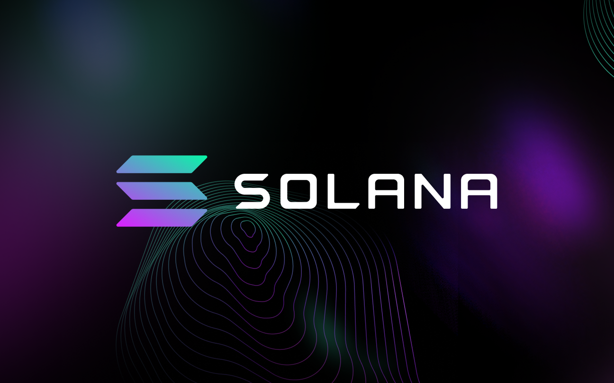
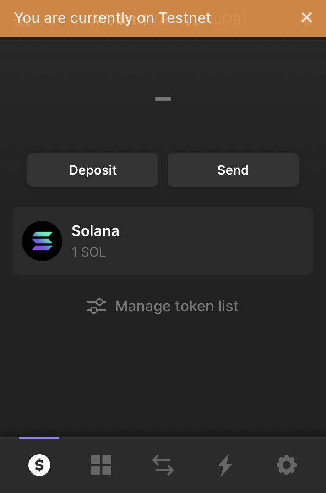
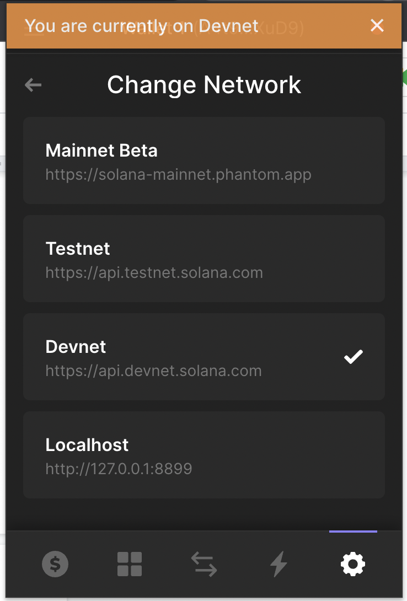
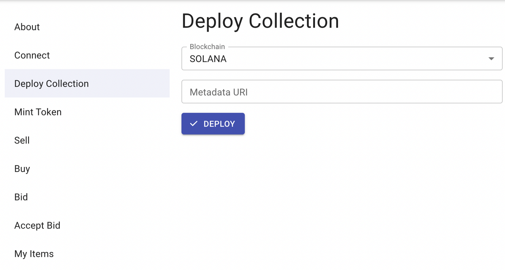
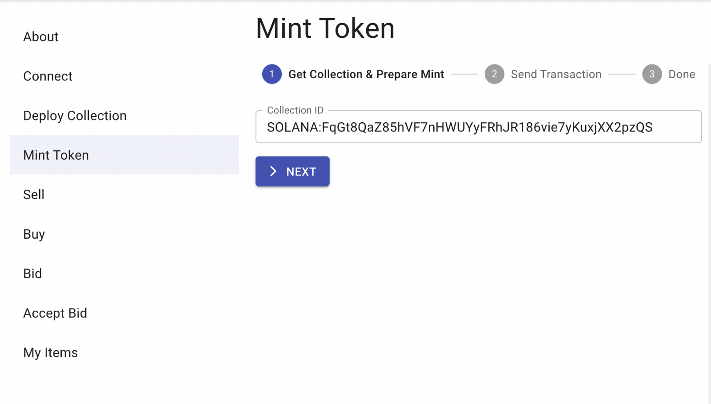

# Create your NFT app on Solana in 10 minutes

### Without a single line of Solidity or Rust code



### What is Solana?

While ETH was reaching new heights in terms of traffic, price, and dApps development, new blockchains have arisen to tackle some of Ethereum’s main problems. One of them is Solana, currently the 6th largest blockchain in terms of market valuation. Ethereum’s main problems are, of course, transaction speed and enormous transaction fees. Solana did manage to solve these perfectly, allowing up to 65,000 transactions per second and reducing transaction costs to $0.00025 per transaction. Going further, Solana has its own programming language that lets us create dApps, NFTs, and more. Overall it’s a pretty solid competitor to Ethereum. 🏅

### Why is Solana worth trying?

As with every blockchain, there are a few things that make Solana unique. Let’s look at some of Solana’s technical features, which are also called the[ **8 innovations of Solana**](https://medium.com/solana-labs/7-innovations-that-make-solana-the-first-web-scale-blockchain-ddc50b1defda#:~:text=Turbine%20%E2%80%94%20a%20block%20propagation%20protocol,Processing%20Unit%20for%20validation%20optimization).

- **Proof-of-History**: In order to make communication cost and latency more efficient in conjunction with Proof-of-Stake, Solana integrates the concept known as a Proof-of-History. It’s a clock before consensus is reached, i.e. before agreeing on a blockchain state. It uses a recursive verifiable delay function to hash incoming events and transactions. It massively reduces overhead, thereby allowing scalability.

- **Sealevel**: “…, a hyper parallelized transaction processing engine designed to scale horizontally across GPUs and SSD”. All other blockchains are single-threaded. Solana changed this status quo and became the first blockchain that is able to support parallel transaction execution in a single shard. It means that the blockchain will only become faster with time, allowing, once again, massive scalability.

- **Gulf Stream**: Solana found a way to manage a mempool size of 100,000. Other blockchains use “gossip protocols” to propagate their mempools, and since gossip protocol, as its name states, achieves its purpose by exchanging information between nodes, it gets overwhelmed. Gulf Stream pushes transactions caching and forwarding to the edge of the network. This makes it possible for validators to execute transactions ahead of time.

- **60,000 Transactions Per Second (TPS): **Currently, Visa / Mastercard can process up to 65,000 TPS, which sets the bar for the cryptocurrencies pretty high (if they ever wish to replace it). In comparison, Bitcoin can process up to 7 TPS, which is super low. Solana, on the other hand, due to the technical solutions listed above can process up to 60,000 TPS!

If you’re curious and want a deeper explanation, you can find the perfect one[ here](https://medium.com/solana-labs/7-innovations-that-make-solana-the-first-web-scale-blockchain-ddc50b1defda#:~:text=Turbine%20%E2%80%94%20a%20block%20propagation%20protocol,Processing%20Unit%20for%20validation%20optimization), written by Anatoly Yakovenko, a Co-Founder of Solana.

### Solana Faucet, aka “Give me free funds!”

Moving forward into the development phase. 👨‍💻 As always, the first step when creating NFTs on any blockchain is to acquire the funds needed for transaction fees. Usually, we use a faucet service in order to get test funds. Solana is no different! After typing “Solana Faucet” on Google, we can see th[e following pag](https://solfaucet.com/)e:


Compared to Tezos, getting test funds on Solana is very simple. But first things first.

**Solana Wallet**

In order to sign and execute transactions, we need some sort of wallet. Unfortunately, since Solana is not compatible with Ethereum, we can’t use Metamask, as it supports only Ethereum-based currencies. That’s not a problem, though! Solana has a similar app named[ Phantom](https://chrome.google.com/webstore/detail/phantom/bfnaelmomeimhlpmgjnjophhpkkoljpa), which is a web browser extension as well as a mobile app wallet, so it’s super convenient to use. It looks like this:





If you want to change the network, you have to go to the settings page at the bottom and change the network to the desired one, which in our case is devnet. **Important: in order to create NFTs, you have to be on [devnet](https://explorer.solana.com/?cluster=devnet), and NOT on testnet; otherwise it won’t work, since Rarible SDK doesn’t support testnet. **After that, click on “Deposit”, copy your wallet address, and paste it into the Solana Faucet. After approximately 0.002 seconds, we should have our test funds available. Ahh, the beauty of Solana. ☀️

### Creating NFTs on Solana blockchain using Rarible SDK

In order to create NFTs on Solana, we will use the exemplary app provided by Rarible. You can get it here:

[**GitHub — rarible/sdk**](https://github.com/rarible/sdk)

[*Rarible Multichain Protocol is a decentralized toolset that simplifies the way developers can work with NFTs. The…*github.com](https://github.com/rarible/sdk)

The exemplary app is located on the **packages/example **in the repo below:

[**sdk/packages/example at master · rarible/sdk**](https://github.com/rarible/sdk/tree/master/packages/example)

[*What we have done in this example: Create Lazy Minting NFT item Create Sell Order Create Bid Purchase (buy item) an…*github.com](https://github.com/rarible/sdk/tree/master/packages/example)

In order to kickstart the project, you have to follow instructions disclaimed on Readme, which basically limits to running:

```
yarn && yarn bootstrap && yarn build-all
```

command from the **root folder **(not the packages/example folder).

**Exemplary Application**


The coolest aspect of the exemplary application is that it showcases all the possibilities the SDK provides. It’s also a fast way to validate what you can achieve with the Rarible SDK (which is a lot 😉).

**Connect Wallet**


In order to create NFTs, we have to connect a wallet first, which in Solana’s case is either Phantom or Solflare. As I stated earlier, I’m going with Phantom. What’s important here **is to set the environment for “development”, **that will allow you to use your wallet. After connecting, you should see the current status as “connected”.

**Deploying Collection**



In order to successfully deploy a collection, you have to pass a Metadata URI, which is a JSON with collection properties, usually stored on IPFS. It looks like this:

```
{
   "name":"Konosuba Characters",
   "symbol":"KNSB",
   "description":"test collection",
   "seller_fee_basis_points":0,
   "image":"https://upload.wikimedia.org/wikipedia/ru/2/23/KonoSuba_light_novel_volume_1_cover.jpg",
   "properties":{
      "files":[
         {
            "type":"image/png",
            "uri":"https://upload.wikimedia.org/wikipedia/ru/2/23/KonoSuba_light_novel_volume_1_cover.jpg"
         }
      ],
      "category":"image",
      "creators":[
         {
            "address":"A4t9PGWWUwwRh…",
            "share":100
         }
      ]
   }
}
```

You can find an explanation about all of the available options for[ Metadata URI here](https://docs.metaplex.com/token-metadata/Versions/v1.0.0/nft-standard). All of the fields are mandatory — properties and image may be empty. Name, symbol, and description are used to describe your token, seller_fee_basis_points is a royalties percentage, i.e. the percent of each following sale that will go to the creator. Image and properties are used for additional assets, and creators tell how the royalties should be distributed. When it comes to uploading documents to IPFS, you can do it as you want. If you’re interested in doing it from the code level, I’ve covered it on[ one of my previous article](https://medium.com/rarible-dao/instagram-to-nft-service-saas-tutorial-part-2-2-creating-nfts-from-ig-posts-56c95bae1eee), but you can alsol use[ Pinata](https://app.pinata.cloud/) for that purpose. After getting your Metadata URI, which is a link to JSON stored on IPFS, and which looks like this:

[https://gateway.pinata.cloud/ipfs/QmbDt5hsCCTE45twSGz33WorHr5vtii96rGsZNL6Ufkrv](https://gateway.pinata.cloud/ipfs/QmbDt5hsCCTE45twSGz33WorHr5vtii96rGsZNL6UfkrvW)W

paste it to the adequate field. The Phantom window should pop up, as it’s shown below. Notice the predicted amount of SOL that will be subtracted from your account as a transaction fee. If you see “transaction may fail to confirm”, it means that either you don’t have enough funds, or you’re connected to the wrong chain.


After a successful collection creation, you should see information about the created collection:


The most important information here is the collection address. With that, you can always fetch any related information from the[ Rarible API](https://multichain-api.rarible.org/) (I’ve also written[ an article about that](https://medium.com/rarible-dao/how-to-use-the-rarible-multichain-protocol-to-find-the-nft-you-need-bd517bf071b5)). After obtaining the collection id, we’re able to create an NFT by going to the “Mint Token” page.

**Minting a Token**



As you can see, there are two steps involved in that process. The first one is passing a collection ID, and the second one is sending a transaction. What’s super cool about the exemplary app is that, on the right side of the screen, there are always code snippets included. You’re able to examine how it actually happens at the code level! Below, you can see an example of token minting.


After the collection ID correctness check, we’re prompted to send a transaction. In order to do that, we have to pass a Metadata URI, which, again, is a JSON with properties that we’ll store on IPFS.


If you’ve passed the correct information, you should see the following screen:


This means that the NFT was successfully created 🏝.

**How to see an NFT’s content**

After the NFT creation, we can check what it contains using the[ Rarible API](https://multichain-api.rarible.org/v0.1_staging#operation/getItemById) with the getItemById endpoint. An exemplary API call looks like this:

[https://api-staging.rarible.org/v0.1/items/SOLANA%3A2oLE3AJiNGiB96ncXCMb8JsMLpX2uHfdcoMDFNEM7BVg](https://api-staging.rarible.org/v0.1/items/SOLANA%3A2oLE3AJiNGiB96ncXCMb8JsMLpX2uHfdcoMDFNEM7BVg)

As a response, we can see all the details of the NFT:

```
{
   "id":"SOLANA:2oLE3AJiNGiB96ncXCMb8JsMLpX2uHfdcoMDFNEM7BVg",
   "blockchain":"SOLANA",
   "collection":"SOLANA:FqGt8QaZ85hVF7nHWUYyFRhJR186vie7yKuxjXX2pzQS",
   "creators":[
      {
         "account":"SOLANA:A4t9PGWWUwwRhpEh3B9AL8uphgwiNZPBmx2H5RwrXuD9",
         "value":10000
      }
   ],
   "lazySupply":"0",
   "pending":[

   ],
   "mintedAt":"2022–05–09T16:17:56Z",
   "lastUpdatedAt":"2022–05–09T16:17:56Z",
   "supply":"1",
   "meta":{
      "name":"Konosuba Characters",
      "description":"test collection",
      "attributes":[

      ],
      "content":[
         {
            "@type":"IMAGE",
            "url":"https://upload.wikimedia.org/wikipedia/ru/2/23/KonoSuba_light_novel_volume_1_cover.jpg",
            "representation":"ORIGINAL",
            "mimeType":"image/jpeg",
            "size":69036,
            "width":352,
            "height":500
         }
      ],
      "restrictions":[

      ]
   },
   "deleted":false,
   "auctions":[

   ],
   "totalStock":"0",
   "sellers":0
}
```

And voila. Freshly minted NFT on Solana ready to trade, hold, or whatever you want to do with that.

### Summary

In this article, we’ve learned how you can take advantage of the Rarible SDK and API to create and see an NFT on Solana. The most important thing to remember while developing is to set your Phantom network to devnet, and the environment to “development” on Rarible SDK. If you remember that, everything else should flow as smooth as butter. 🧈
