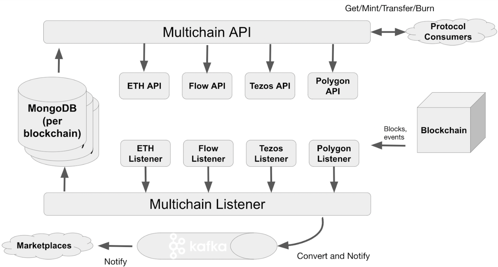

# Architecture

Rarible Multichain protocol is built on 3-layer architecture:

* Blockchain Indexing Layer – a set of listeners to retrieve blockchain events process them and store in Rarible Database in a form of business objects
* Smart-Contracts – provide common logic to operate NFT-assets, e.g., minting, selling, transferring, auctions, etc.
* Multichain API – SDK for developers to use protocol capabilities in a simple blockchain-agnostic manner

<figure markdown>
{ width="700" }
  <figcaption>Protocol architecture</figcaption>
</figure>

The Protocol is primarily targeted to NFTs, but it's not limited to NFTs only. Any asset on EVM blockchain can be traded on Rarible.

Rarible doing indexing per each blockchain integrated into protocol. Following events are listened:

* Block events
* Log events

Rarible Multichain Protocol is fast performing and able to retrieve blocks with up to 2 seconds delay from blockchain. Blockchain restructuring is supported – changed blocks are indexed again to resolve discrepancies if any.

Likewise, blockchain indexing Rarible protocol listens for most popular NFT-marketplaces to retrieve their order books, this helps to store in Rarible database both on-chain and off-chain information.

Smart-contracts are constructed in the way to be upgradeable, orders have versioning information, so new fields can be added if needed in the future.

All smart-contracts in Rarible before publishing pass mandatory security audit, so only verified reliable versions are provided with protocol.

Multichain API provides blockchain agnostic SDK to:

* Search and retrieve business objects from Rarible Database (NFTs, orders, collections and detailed information about these objects)
* Perform on-chain actions – mint, sell, transfer NFTs
* Perform off-chain activities like lazy-minting
* Apply royalties and organize auctions

In addition, Rarible Multichain Protocol provides information for dedicated customers to retrieve information about business objects changed immediately	 in publish-subscribe manner using Apache Kafka feed. Indexed events are sent to Apache Kafka in the same time they are stored in the database.
