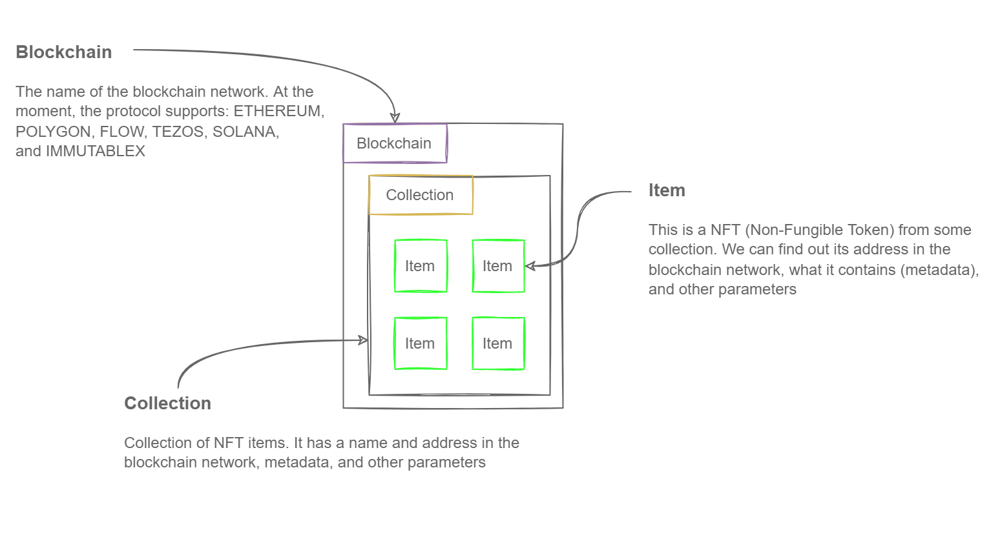
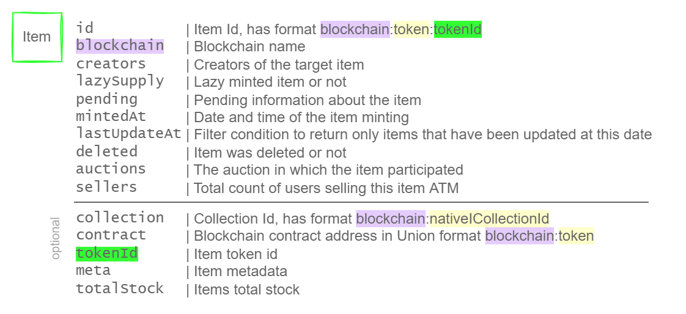
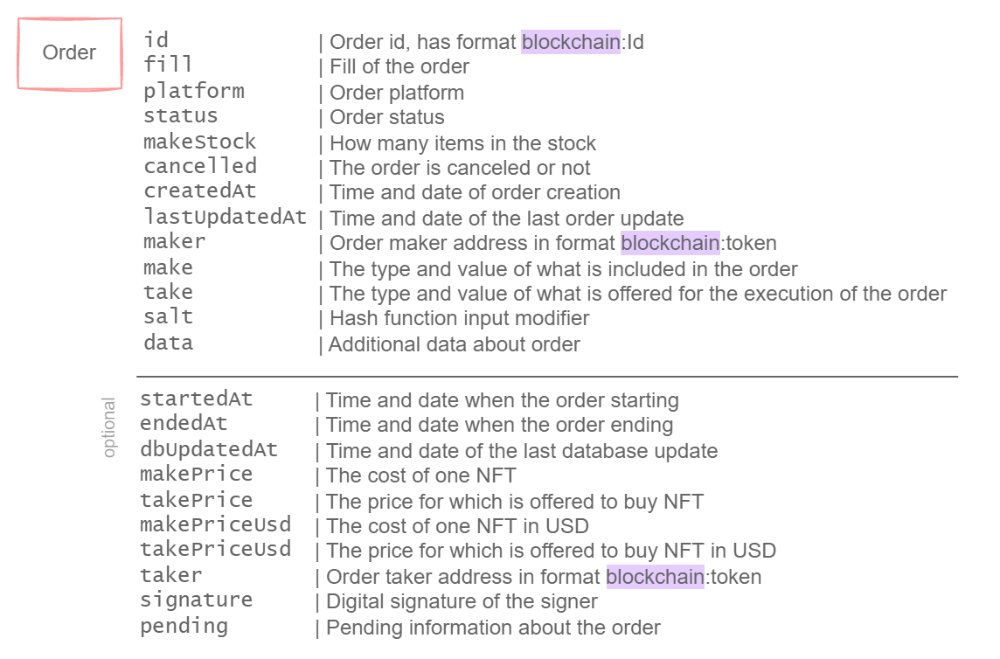

# Protocol Data Model

Rarible Protocol uses the following basic concepts to form the Data Model:

* `item` — NFT (Non-Fungible Token)
* `collection` — collection of NFT items
* `blockchain` — name of the blockchain network
* `order` — intent to sell an NFT
* `activity` — events with items like "MINT", "SELL" etc.

Collections and items have their own `id`, that contain the `blockchain` and different types of `tokens`.

<figure markdown>
{ width="1000" }
</figure>

## Item

The `item` has an array of required and optional parameters. It depends on several parameters and contains the name of the `blockchain`, address or `token` of the item `collection`.

<figure markdown>
{ width="800" }
</figure>

## Collection

The `collection` has an array of required and optional parameters too. It depends on several parameters and contains the name of the `blockchain` and `tokens` of the `collection`.

<figure markdown>
{ width="800" }
</figure>

## Order

Order means intent to sell an NFT for a given price. To complete the Order, accept the Bid from the potential buyer.

<figure markdown>
{ width="800" }
</figure>

The `order` has an array of required and optional parameters. It depends on several parameters and contains the name of the `blockchain` too.

<figure markdown>
{ width="800" }
</figure>

You can find more information and examples on [Search Capabilities](../reference/search-capabilities.md) page.
