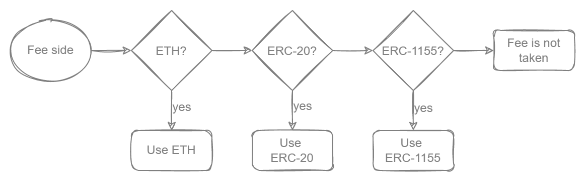

# Tokens, Fees, and Royalties

## What is NFT

NFT means Non-Fungible Token. “Non-fungible” more or less means that it’s unique and can’t be replaced with something else. For example, a bitcoin is fungible — trade one for another bitcoin, and you’ll have exactly the same thing.

NFTs on the other hand are one-of-a-kind tokens that represent a unique good or asset which are non-fungible. If you traded it for a different NFT, you’d have something completely different.

NFTs can really be anything digital (such as drawings, music, videos, etc.), but a lot of the current excitement is around using the tech to sell digital art.

## Tokens

Rarible Multichain Protocol various token types applicable for certain blockchain:

* Ethereum/Polygon:

    * [ERC-721](https://eips.ethereum.org/EIPS/eip-721)
    * [ERC-1155](https://eips.ethereum.org/EIPS/eip-1155)
    * Rarible user-owned contracts (ERC-721 and ERC-1155) — users deploy these contracts, only owners can mint in these
* Immutablex
  * [ERC-721](https://eips.ethereum.org/EIPS/eip-721)
* [Flow standard tokens](https://github.com/onflow/flow-nft/blob/master/contracts/NonFungibleToken.cdc)
* [FA2 (TZIP-012)](https://gitlab.com/tezos/tzip/-/blob/master/proposals/tzip-12/tzip-12.md) for Tezos
* Cryptopunks

A full list of supported token types could be found on [Features](../features.md) page.

All these contracts support these features:

* lazy mint
* Rarible on-chain royalties
* multiple creators
* upgradeable
* supports operators (who can transfer tokens on behalf of users) for the whole smart contract

User-owned contracts use beacon proxies, and these contracts can be updated by Rarible DAO. Rarible common contracts can be upgraded too.

## Fees

Rarible Multichain Protocol supports the following types of fees that are applicable to token operations:

* Protocol fees — are charged on both sides of the transaction
* Origin fees — set for each order. It may differ for two orders
* Royalties — the author of the work will receive a part of each sale

Here is an example, how do we calculate fees for Ethereum for each side of the transaction:

<figure markdown>
{ width="800" }
  <figcaption></figcaption>
</figure>

* If there is ETH on any side of the transaction, it is used
* If there is no ETH, we check if there is an ERC-20 and use it
* If there is no ERC-20, check if there is an ERC-1155 and use it
* Otherwise, no fee will be charged. (e.g., if two ERC-721 are involved in the transaction)

When computing the total amount of the asset:

* The protocol fee is added on top of the filled amount
* The fee for sending the buyer's order is also added on top

If the buyer uses the ERC-20 token for payment, he must approve the calculated number of tokens.

If the buyer uses ETH, they must send the calculated amount to ETH along with the transaction.

## Royalties

Rarible Multichain Protocol supports two types of royalties:

* RoyaltiesV1 — defines an interface to query royalties from a contract. This is implemented on the standard Rarible token contracts.
* RoyaltiesV2 — the exchange contract interacts with the Rarible royalties implementation indirectly through a Royalty Registry. The registry checks if the NFT contract supports the expected interface, and if so, queries for the Rarible royalties array.
* EIP-2981 — allows contracts, such as NFTs that support ERC-721 and ERC-1155 interfaces, to signal a royalty amount to be paid to the NFT creator or rights holder every time the NFT is sold or re-sold. This is intended for NFT marketplaces that want to support the ongoing funding of artists and other NFT creators.

For RoyaltiesV1, contract exposes `getRoyalties` method, which expects an ID as input (usually tokenId) and returns an array of accounts & basis points.

RoyaltiesV2 allows for Rarible to support different royalty standards for different collections.

Rarible Multichain Protocol Supports on-chain royalties. These are handled in the ExchangeV1 contract by the royalties array, which is needed to execute the mint function.

This tuple is made up of two variables, `fees.recipient` and `fees.value`:

* `fees.recipient` — refers to either the item owner (by default) or an address where the royalties will be received.
* `fees.value` — the royalties percentage. By default, this value is 1000 on Rarible, which is a 10% royalties fee. This is done using basis points. More information regarding basis point can be found here.
