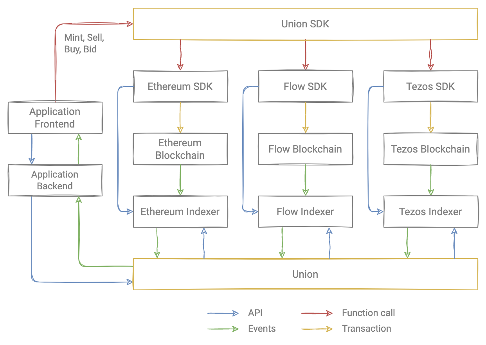

# Rarible Union Protocol

Rarible Union Protocol is a tool to query, issue and trade NFTs on these blockchains:

* [Ethereum](../ethereum/ethereum-overview.md)
* [Flow](../flow/flow-overview.md)
* [Tezos](../tezos/tezos-overview.md)
* Polygon (WIP, coming soon)

The Rarible Union Protocol is based on the blockchain layer (smart contracts written for every blockchain supported). These smart contracts allow users to mint and exchange tokens.

On top of the contracts, we built indexers to index part of the blockchain state. This gives us the possibility to query data about NFTs.

Then, SDKs were written to interact with smart contracts.

All these components are written for every blockchain supported and are used in [Union service](https://github.com/rarible/union-service) and [Union SDK](https://github.com/rarible/sdk).

Applications need to integrate Union service and Union SDK to be able to interact with all blockchains in the same way.

<figure markdown>
{ width="600" }
  <figcaption>Protocol architecture</figcaption>
</figure>

## Features

* [Mint](https://github.com/rarible/sdk#mint) (issue, create) NFTs
* Trade NFTs ([sell](https://github.com/rarible/sdk#sell), [bid](https://github.com/rarible/sdk#bid), [auction](https://github.com/rarible/sdk#auction))
* [Transfer](https://github.com/rarible/sdk#transfer)
* [Burn](https://github.com/rarible/sdk#burn)
* [Query](https://github.com/rarible/sdk#querying) information about NFTs

See [more reasons](../getting-started/reasons.md) to build on Rarible Protocol.

## API Reference

We use different environments for blockchain networks. See actual information on [API Reference](../api-reference.md) page.

## SDK

[Rarible Protocol SDK](https://github.com/rarible/sdk) enables applications to easily interact with Rarible protocol: [query](https://github.com/rarible/sdk#querying), [issue](https://github.com/rarible/sdk#mint), [trade](https://github.com/rarible/sdk#sell) NFTs on any blockchain supported.

See more information on [Union SDK](../union-sdk.md) page.
