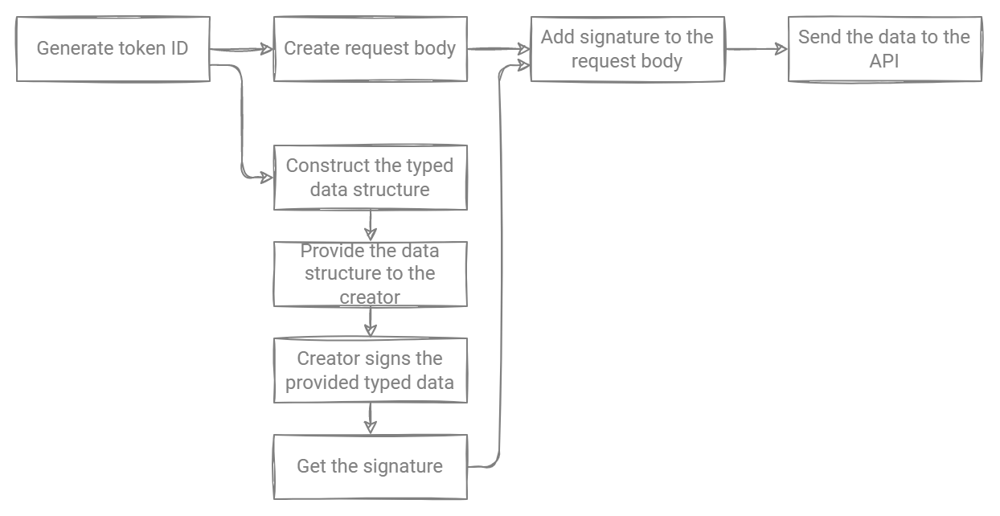

# Mint

You can Mint NFTs with Rarible Multichain Protocol in different blockchains.

--8<-- "docs/snippets/preparation-sdk.md"

## Minting Multichain

### Lazy Minting (off-chain)

Use `mintOffChain` function:

```typescript
import { createRaribleSdk } from "@rarible/sdk"
import { toContractAddress, toUnionAddress } from "@rarible/types"
import type { BlockchainWallet } from "@rarible/sdk-wallet/src"
import { MintType } from "@rarible/sdk/build/types/nft/mint/domain"

async function mintOffChain(wallet: BlockchainWallet, contractAddress: string) {
	const sdk = createRaribleSdk(wallet, "dev")

	const mintAction = await sdk.nft.mint({
		collectionId: toContractAddress(contractAddress),
	})
	/*
    You should upload json file with item metadata in the following format:
    {
      name: string
      description: string | undefined
      image: string | undefined
      "animation_url": string | undefined
      "external_url": string | undefined
      attributes: TokenMetadataAttribute[]
    }
    and insert link to json file to "uri" field.
    To format your json data use "sdk.nft.preprocessMeta()" method
   */
	const mintResult = await mintAction.submit({
		uri: "<YOUR_LINK_TO_JSON>",
		royalties: [{
			account: toUnionAddress("<ROYLATY_ADDRESS>"),
			value: 1000,
		}],
		creators: [{
			account: toUnionAddress("<CREATOR_ADDRESS>"),
			value: 10000,
		}],
		lazyMint: true,
		supply: 1,
	})
	if (mintResult.type === MintType.OFF_CHAIN) {
		return mintResult.itemId
	}
}
```

* `collectionId` — your collection address, that can be already [deployed](deploy-collection.md). Also, can be the address of Rarible Smart Contracts instance. You can find them on [Contract Addresses](contract-addresses.md) page
* `ContractAddress` — `BlockchainName:HexAddress` = `ETHEREUM:0xB0EA149212Eb707a1E5FC1D2d3fD318a8d94cf05`
    * `BlockchainName` — `ETHEREUM`, `FLOW`, `TEZOS` or `POLYGON`
* `uri` — address of JSON file with "image", "name" and other NFT attributes. For example, on IPFS: [https://ipfs.io/ipfs/QmWLsBu6nS4ovaHbGAXprD1qEssJu4r5taQfB74sCG51tp](https://ipfs.io/ipfs/QmWLsBu6nS4ovaHbGAXprD1qEssJu4r5taQfB74sCG51tp)
* `royalties` — value and address for receiving royalties
* `creators` — value and address of the creator
* `lazyMint` — boolean, `false` if you want to mint item on the blockchain, `true` allow to you mint off-chain item without spending the gas
* `supply` — number of NFTs to create (not in every case it is supported, you can check it by reading `sdk.nft.mint` response under multiple parameters)

Example of a successful response:

```typescript
itemId: "ETHEREUM:0x6ede7f3c26975aad32a475e1021d8f6f39c89d82:55143609719300586327244080327388661151936544170854464635146779205246455382047";
type: "off-chain"
```

* `itemId` —  ItemID of your NFT, has format `${blockchain}:${token}:${tokenId}`. For example, `ETHEREUM:0x6ede7f3c26975aad32a475e1021d8f6f39c89d82:12345`

### Minting (on-chain)

Use `mintOnChain` function:

```typescript
import { createRaribleSdk } from "@rarible/sdk"
import { toContractAddress, toUnionAddress } from "@rarible/types"
import type { BlockchainWallet } from "@rarible/sdk-wallet/src"
import { MintType } from "@rarible/sdk/build/types/nft/mint/domain"

async function mintOnChain(wallet: BlockchainWallet, contractAddress: string) {
	const sdk = createRaribleSdk(wallet, "dev")

	const mintAction = await sdk.nft.mint({
		collectionId: toContractAddress(contractAddress),
	})
	/*
  You should upload json file with item metadata in the following format:
  {
    name: string
    description: string | undefined
    image: string | undefined
    "animation_url": string | undefined
    "external_url": string | undefined
    attributes: TokenMetadataAttribute[]
	}
	and insert link to json file to "uri" field.
	To format your json data use "sdk.nft.preprocessMeta()" method
   */
	const mintResult = await mintAction.submit({
		uri: "<YOUR_LINK_TO_JSON>",
		royalties: [{
			account: toUnionAddress("<ROYLATY_ADDRESS>"),
			value: 1000,
		}],
		creators: [{
			account: toUnionAddress("<CREATOR_ADDRESS>"),
			value: 10000,
		}],
		lazyMint: false,
		supply: 1,
	})
	if (mintResult.type === MintType.ON_CHAIN) {
		await mintResult.transaction.wait()
		return mintResult.itemId
	}
}
```

## Checking created NFT

To check the created item:

* Use the `getItemById` [API method](https://api.rarible.org/v0.1/doc#operation/getItemById)

    ??? note "getItemById"
    
        Returns Item by ID.
        
        `https://api.rarible.org/v0.1/items/{itemId}`
        
        **Example request (staging)**
        
        ```shell
        curl --request GET 'https://api-staging.rarible.org/v0.1/items/ETHEREUM:0x6ede7f3c26975aad32a475e1021d8f6f39c89d82:19661880631107248865491477079747186145992059189823053172927066273904580362243'
        ```
        
        Request parameters:
        
        * `itemId` —  ItemID of your NFT, has format `${blockchain}:${token}:${tokenId}`
        
            For example, `ETHEREUM:0x6ede7f3c26975aad32a475e1021d8f6f39c89d82:12345`
        
        **Example response (status 200)**
    
        ```json
        {
           "id": "ETHEREUM:0x6ede7f3c26975aad32a475e1021d8f6f39c89d82:19661880631107248865491477079747186145992059189823053172927066273904580362243",
           "blockchain": "ETHEREUM",
           "collection": "ETHEREUM:0x6ede7f3c26975aad32a475e1021d8f6f39c89d82",
           "contract": "ETHEREUM:0x6ede7f3c26975aad32a475e1021d8f6f39c89d82",
           "tokenId": "19661880631107248865491477079747186145992059189823053172927066273904580362243",
           "creators": [
              {
                 "account": "ETHEREUM:0x2b783ae5b5b8a7a822449c7d8b6f35f9abc827f5",
                 "value": 10000
              }
           ],
           "owners": [],
           "royalties": [],
           "lazySupply": "0",
           "pending": [],
           "mintedAt": "2022-03-09T22:48:33Z",
           "lastUpdatedAt": "2022-03-09T22:50:03.530Z",
           "supply": "1",
           "meta": {
              "name": "gbgbgbgbgbgb",
              "description": "",
              "attributes": [],
              "content": [
                 {
                    "@type": "IMAGE",
                    "url": "https://rarible.mypinata.cloud/ipfs/QmQCp8bhbaPwGEuHeeR8pme2q3zuSjam2JEuFgAvp4DZsU/image.jpeg",
                    "representation": "ORIGINAL",
                    "mimeType": "image/jpeg",
                    "size": 13311,
                    "width": 640,
                    "height": 640
                 }
              ],
              "restrictions": []
           },
           "deleted": false,
           "auctions": [],
           "totalStock": "0",
           "sellers": 0
        }
        ```

* Or check [Etherscan](https://etherscan.io/) for Ethereum and Polygon, [Flowscan](https://flowscan.org/) for Flow, or [tezblock](https://tezblock.io/) for Tezos.

You can find more information about Mint in [Rarible Protocol SDK](https://github.com/rarible/sdk#mint). Or you can use it as a regular async function and work with regular Promises.

## Minting in specific blockchain networks

We recommend using the Multichain Protocol for minting tokens. But you can also make Mint on a specific blockchain network.

??? tip "Ethereum"

    With Rarible Protocol Ethereum SDK, you can mint and lazy mint ERC-721 and ERC-1155 NFT tokens in the Ethereum network.
    
    **Mint**
    
    Minting is using the `mintAndTransfer` function for ERC-721 and ERC-1155 contracts.
    
    For ERC-721, the function has the following signature:`mintAndTransfer(LibERC721LazyMint.Mint721Data memory data, address to)`.
    
    ```
    struct Mint721Data {
            uint tokenId;
            string tokenURI;
            address[] creators;
            LibPart.Part[] royalties;
            bytes[] signatures;
    }
    ```
    
    * **tokenId** — **tokenId** of the ERC-721 standard
    * **tokenURI** — suffix for the token URI. The prefix is usually `ipfs://ipfs/`
    * **creators** — an array of authors addresses
    * **royalties** — royalty array
    * **signatures** — array of signatures. Each creator must have a signature. The only exception is when the creator sends a Mint transaction.
    
    For ERC-1155, the function has the following signature: `mintAndTransfer(LibERC1155LazyMint.Mint1155Data memory data, address to, uint256 _amount)`.
    
    ```
    struct Mint1155Data {
            uint tokenId;
            string tokenURI;
            uint supply;
            address[] creators;
            LibPart.Part[] royalties;
            bytes[] signatures;
    }
    ```
    
    * **tokenId** — **tokenId** of the ERC-1155 standard
    * **tokenURI** — suffix for the token URI. The prefix is usually `ipfs://ipfs/`
    * **supply** — total number of tokens for minting
    * **creators** — an array of authors addresses
    * **royalties** — royalty array
    * **signatures** — array of signatures. Each creator must have a signature. The only exception is when the creator sends a Mint transaction.
    
    **Lazy Mint**
    
    Lazy Minting is supported for ERC-721 and ERC-1155.
    
    <figure markdown>
    { width="600" }
      <figcaption>Lazy mint</figcaption>
    </figure>
    
    To create Lazy Minting:
    
    1. Generate a token ID.
    2. Create a Lazy Minting request body that the creator must sign.
    3. The creator signs the provided data.
    4. Add signature to the request body
    5. Send the data to the API.
    
    [See an example](../ethereum/api/create-lazy-minting.md) of creating Lazy Minting by using API.
    
    For more information about Lazy Minting, see [SDK](https://github.com/rarible/ethereum-sdk) page. 

??? tip "Flow"

    With Rarible Protocol Flow SDK, you can mint Flow NFT tokens.
    
    Mint response represents transaction result extended with `txId` and minted `tokenId`
    
    ```typescript
    const {
      txId, // transaction id
      tokenId, // minted tokenId
      status, // flow transaction status
      statusCode, // flow transaction statusCode - for example: value 4 for sealed transaction
      errorMessage,
      events, // events generated from contract and include all events produced by transaction, deopsits withdrown etc.
    } = await sdk.nft.mint(collection, "your meta info", [])
    ```

??? tip "Tezos"

    With Rarible Protocol Tezos SDK, you can mint Tezos NFT tokens.
    
    ```typescript
    const result = await mint(
      provider: Provider,
      contract: string,
      royalties : { [key: string]: BigNumber },
      supply?: BigNumber,
      token_id?: BigNumber,
      metadata?: { [key: string]: string },
      owner?: string,
    )
    ```

See more information about usage Protocol SDK on [https://github.com/rarible/sdk](https://github.com/rarible/sdk)
