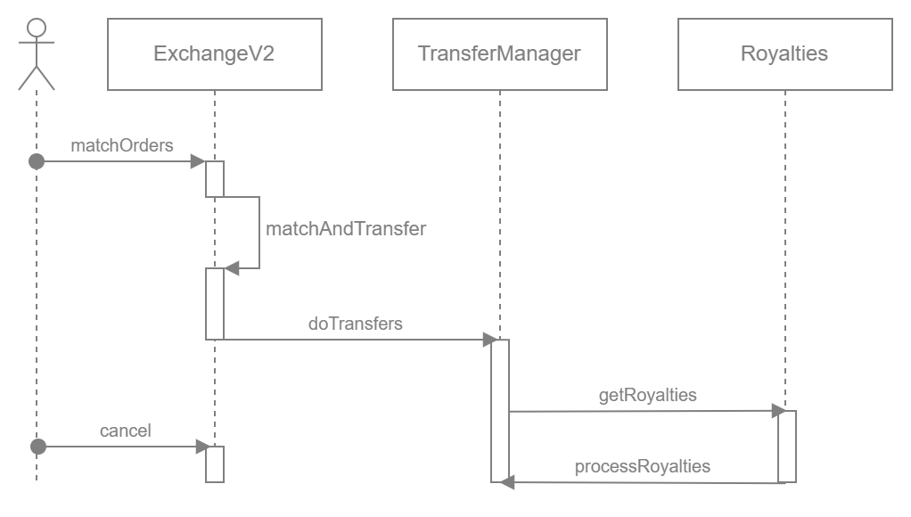

# Rarible Protocol Tezos

## Overview

Tezos has low fees, high performance, and a smaller carbon footprint than proof-of-work blockchains as a proof-of-stake blockchain.

Main features:

* Creating NFTs on the Tezos blockchain
* API server similar to the one already available for [Ethereum](https://ethereum-api.rarible.org/v0.1/doc)
* SDK in the same model as [Ethereum](https://github.com/rarible/protocol-ethereum-sdk)
* Using [Crawlori](https://gitlab.com/functori/crawlori) to crawl the Tezos blockchain

Support for the Tezos was built by Tezos team:

- Backend and SDK was built by [Functori](https://www.functori.com/)
- [Edukera](http://www.edukera.com/) and [Nomadic Labs](https://www.nomadic-labs.com/) managed the smart contracts

Source code is available [here](https://gitlab.com/tezos-paris-hub/rarible/rarible-backend/).

Tezos API and SDK documentation can be found [here](https://tezos-paris-hub.gitlab.io/rarible/rarible-backend/).

## Smart Contracts

Tezos Exchange smart contracts it's a port of the [Rarible ExchangeV2](https://github.com/rarible/protocol-contracts/tree/master/exchange-v2) contract.

The diagram below presents the process flow between contracts:

To see more details about the smart contracts as well as their code, check the [Exchange Contracts](https://gitlab.com/tezos-paris-hub/rarible/rarible-smart-contracts) and [NFT Contracts](https://gitlab.com/tezos-paris-hub/rarible/rarible-nft-contracts) on the GitLab repo.

## API Reference

Use these base URL to access API on the Tezos network:

| Base URL | Network          | Net     |
| :--- |:-----------------|:--------|
| [https://rarible-api-mainnet.functori.com/v0.1](https://rarible-api-mainnet.functori.com/v0.1) | Tezos | Mainnet |
| [https://rarible-api.functori.com/v0.1](https://rarible-api.functori.com/v0.1) | Tezos | Hangzhou |

Tezos API documentation can be found [here](https://tezos-paris-hub.gitlab.io/rarible/rarible-backend/api/).

## SDK

SDK in the same model as [Ethereum](https://github.com/rarible/protocol-ethereum-sdk). It will allow interacting "programmatically" with the smart contract and the API server.

Tezos SDK documentation can be found [here](https://tezos-paris-hub.gitlab.io/rarible/rarible-backend/sdk/).

For more information on using the Rarible Protocol Tezos SDK, see the [Tezos repo](https://gitlab.com/tezos-paris-hub/rarible/rarible-backend) on GitLab.
