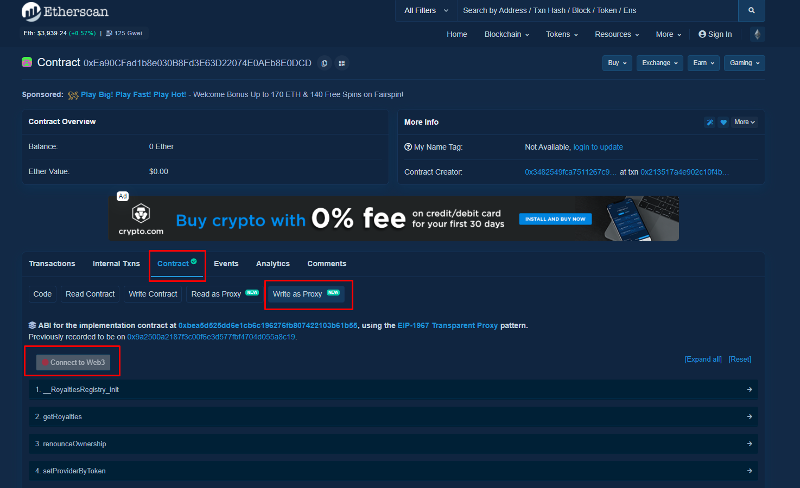
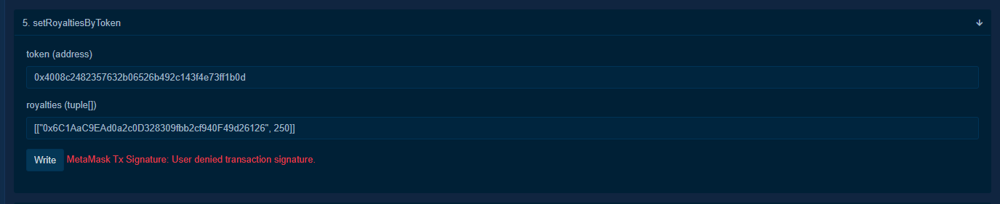

# Setting Up Royalties on an External Collection

1. Open the royalties contract in a new tab: [**https://etherscan.io/address/0xEa90CFad1b8e030B8Fd3E63D22074E0AEb8E0DCD#writeProxyContract**](https://etherscan.io/address/0xEa90CFad1b8e030B8Fd3E63D22074E0AEb8E0DCD#writeProxyContract)
2. Active **Contract** tab. Make sure **Write as Proxy** is selected near the top.
3. Click **Connect to Web3**.

    

4. Expand the **setRoyaltiesByToken** function to set the royalties for the entire collection.

    You will now need to enter the **collection address** in the **Token (Address)** field followed by the tuple for royalties. An example of a tuple is below.

    The first part of the tuple must be the address where you'd like to receive the royalties. The second part is the percentage as Basis Points ie: 1000 = 10% Royalties.

    Below is an example of a tuple which gives the user (**0x6C1AaC9EAd0a2c0D328309fbb2cf940F49d26126**) 1% royalties on items in the collection.

    The maximum royalties value is 10000 (100%).

    ```
    [["0x6C1AaC9EAd0a2c0D328309fbb2cf940F49d26126", 100]]
    ```

    In the screenshot below you can see that on the collection (**0x4008c2482357632b06526b492c143f4e73ff1b0d**) the user (**0x6C1AaC9EAd0a2c0D328309fbb2cf940F49d26126**) receives 2.5% (250) Royalties.

    

5. Click on **Write** button which will bring up your connected wallet and ask you to pay gas fees to execute a transaction.

    

Now that Royalties have been set up, royalties will be paid out on every sale in that collection.

Below is an example of a purchase transaction with annotations on what each fee is for:


