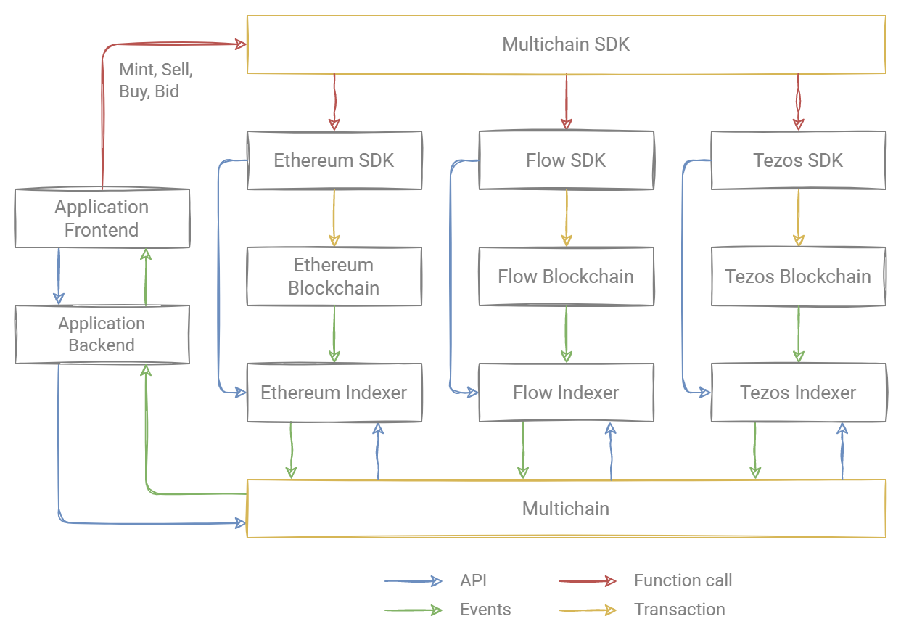

# Architecture

## Union

- Unites three services - Ethereum, Flow, and Tezos.
- Represents all NFT as a single space.
- Developers can use the API and SDK.
- Abstract the blockchain from the application. The user can use applications without being tied to a specific blockchain.

## Example of NFT purchase flow

1. Click buy NFT in the app.
2. The frontend calls the Buy function in the Union SDK.
3. Union SDK calls the Buy function in the SDK of the desired network.
4. SDK prepares and sends the transaction to the underlying blockchain.
5. Indexer listens to purchase, transfer events, updates NFT state internally.
6. Indexer transmits the event to Union.
7. Union sends the information about the event to the backend of the application.

