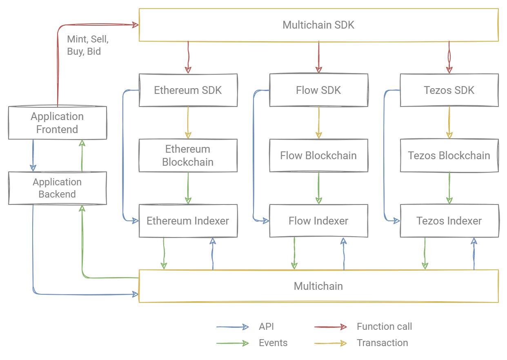

# Rarible Protocol Overview

Rarible protocol combines smart contracts for minting, exchanging tokens, APIs for order creation, discovery, standards used in smart contracts.

## Getting Started

Look at [Example App](getting-started/protocol-example.md) for a quick start.

## Protocol Features

1. Protocol abstract the blockchain from the application. The user can use applications without being tied to a specific blockchain.
2. Supports multiple blockchain networks:
   - [Ethereum](ethereum/ethereum-overview.md)
   - Flow
   - Tezos
3. Represents all NFT as a single space.
4. Available [API](overview/api-reference.md) and [SDK](SDK/sdk.md) for developers.
5. Includes contracts, standards, and APIs for:
   - [Mint](SDK/mint.md)
   - Transfer
   - Sell
   - Swap
   - Bid
   - Burn
   - List
   - Cancel

## Architecture

The architecture of the Protocol:

